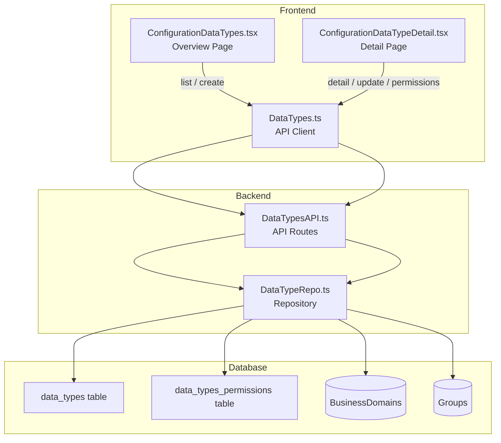
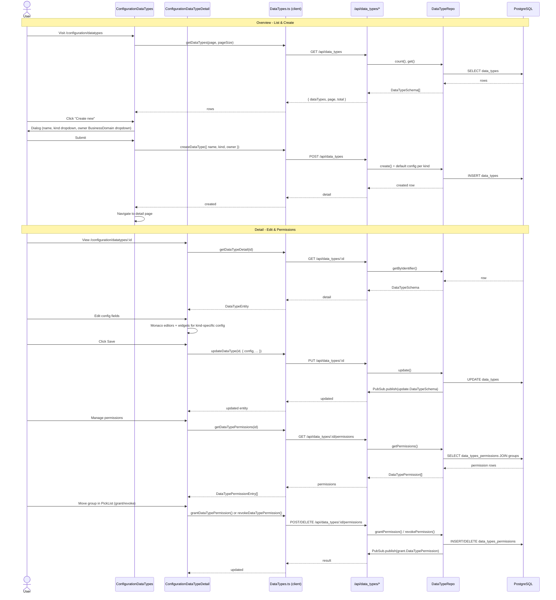

# DataTypes UI – Design

## Overview

This document describes the architecture and implementation plan for the DataTypeSchema management UI in the Configuration section. DataTypes are configuration entities with a discriminated JSONB `config` field (shape depends on `kind`) and group-based role permissions (`DataTypePermission`).

## Current State

### Schema ([`src/schema/DataTypeSchema.ts`](../src/schema/DataTypeSchema.ts))

- **`DataTypeSchema`** table: `baseColumnsNamedDescribed` + `kind`, `mandatory`, `requestorCanEdit`, `config (jsonb)`, `owner (→ BusinessDomains)`
- **`DataKind`**: `calculated | boolean | numeric | string | lookup | consumable | product`
- **Config discriminated union**: `ConfigCalculated | ConfigBoolean | ConfigNumeric | ConfigString | ConfigLookup | ConfigConsumable | ConfigProduct`
  - Each config type contains JS scripts (for validation, defaults, filtering, calculation) and kind-specific fields (decimals, min/max, multi, source, etc.)
- **`DataTypePermission`** table: `dataTypeIdentifier → DataTypeSchema`, `groupIdentifier → Group`, `role (viewer|writer|approver)`, `showByDefault`, `createdBy`, `createdAt`

### Current Repo ([`src/repo/DataTypeRepo.ts`](../src/repo/DataTypeRepo.ts))

Uses `createConfigurationRepository` factory from `_crud_Repo.ts`. This is insufficient because:
1. The factory's generic typing cannot express the discriminated `config` field properly
2. `DataTypePermission` CRUD is not covered by the factory
3. **`_crud_Repo.ts` must remain unchanged**

### Gap Analysis

| Concern | Current | Needed |
|---------|---------|--------|
| DataTypeSchema CRUD | Generic factory with weak config typing | Hand-written repo with proper config typing per kind |
| DataTypePermission | Not implemented | Full CRUD for group-role assignments |
| API routes | None | List, detail, create, update, disable + permission routes |
| Frontend overview | None | Name, kind, enabled toggle, create popup (name+kind+owner) |
| Frontend detail | None | All fields, config editor (Monaco + widgets), permission PickLists |
| Functional permissions | None | FP_VIEW_DATA_TYPES, FP_MANAGE_DATA_TYPES |

## Architecture



## Implementation Plan

### Step 1: Functional Permissions

**Server** (in [`src/services/auth/app_functional_perms.ts`](../src/services/auth/app_functional_perms.ts)):
```typescript
const FP_VIEW_DATA_TYPES_DEF = { functionalPermissionName: "view_data_types", description: "Permitted to view data types.", group: "Configuration" };
export const FP_VIEW_DATA_TYPES = await registerFunctionalPermission(...);

const FP_MANAGE_DATA_TYPES_DEF = { functionalPermissionName: "manage_data_types", description: "Permitted to create, edit, enable, and disable data types.", group: "Configuration" };
export const FP_MANAGE_DATA_TYPES = await registerFunctionalPermission(...);
```

**Client** (in [`src/ui/auth/app_functional_permissions.ts`](../src/ui/auth/app_functional_permissions.ts)):
```typescript
FP_VIEW_DATA_TYPES: "view_data_types",
FP_MANAGE_DATA_TYPES: "manage_data_types",
// ...
export const FP_VIEW_DATA_TYPES = { functionalPermissionName: FunctionalPermissionNames.FP_VIEW_DATA_TYPES } as const;
export const FP_MANAGE_DATA_TYPES = { functionalPermissionName: FunctionalPermissionNames.FP_MANAGE_DATA_TYPES } as const;
```

### Step 2: PubSub Topics

Add in [`src/types/DataTypeSchema.ts`](../src/types/DataType.ts):
```typescript
export const message_DataTypePermission_Grant: string = "grant.DataTypePermission";
export const message_DataTypePermission_Revoke: string = "revoke.DataTypePermission";
export const message_DataTypePermission_Update: string = "update.DataTypePermission";
```

### Step 3: DataTypeRepo Rewrite

[`src/repo/DataTypeRepo.ts`](../src/repo/DataTypeRepo.ts) must be rewritten **without** using `createConfigurationRepository` or any factory from `_crud_Repo.ts`.

**DataTypeSchema CRUD** (hand-written, no factory):
- `count(db, includeDisabled)` – count rows
- `get(db, includeDisabled, condition, page, pageSize, ...orderBy)` – list with pagination; include `kind` field for overview
- `getByIdentifier(db, identifier, includeDisabled)` – single row
- `create(db, user, input: { name, kind, owner, config?, description?, mandatory?, requestorCanEdit? })` – create with proper config default per kind
- `update(db, user, identifier, input, knownUpdatedAt)` – partial update; allow changing `config` sub-fields
- `disable(db, user, identifier, knownUpdatedAt)` / `enable(...)` – toggle disabled flag

**DataTypePermission CRUD**:
- `getPermissions(db, dataTypeIdentifier)` – returns `DataTypePermission[]` with group name joined
- `grantPermission(db, user, { dataTypeIdentifier, groupIdentifier, role, showByDefault? })` – upsert grant
- `revokePermission(db, dataTypeIdentifier, groupIdentifier, role)` – delete assignment
- `updatePermission(db, dataTypeIdentifier, groupIdentifier, role, { showByDefault }, knownUpdatedAt)` – update `showByDefault`

**Config defaults per kind** (used on create when config not provided):
| Kind | Default Config |
|------|---------------|
| calculated | `{ script: undefined, mode: "on_change" }` |
| boolean | `{ permitEmpty: false, defaultProvider: undefined, validate: undefined }` |
| numeric | `{ decimals: 0, min: undefined, max: undefined, defaultProvider: undefined, validate: undefined }` |
| string | `{ min: 0, max: undefined, multi: false, defaultProvider: undefined, validate: undefined }` |
| lookup | `{ source: undefined, multi: false, defaultProvider: undefined, filter: undefined, validate: undefined }` |
| consumable | `{ source: undefined, multi: false, defaultProvider: undefined, filter: undefined, validate: undefined }` |
| product | `{ multi: false, defaultProvider: undefined, filter: undefined, validate: undefined }` |

### Step 4: API Routes

New file: [`src/api/DataTypesAPI.ts`](../src/api/DataTypesAPI.ts)

| Method | Path | Description | Auth |
|--------|------|-------------|------|
| GET | `/data_types` | List with name, kind, enabled; paginated | FP_VIEW_DATA_TYPES |
| GET | `/data_types/:datatypeid` | Full detail including config | FP_VIEW_DATA_TYPES |
| POST | `/data_types` | Create (body: name, kind, owner) | FP_MANAGE_DATA_TYPES |
| PUT | `/data_types/:datatypeid` | Update fields + config | FP_MANAGE_DATA_TYPES |
| PATCH | `/data_types/:datatypeid/disabled` | Toggle disabled | FP_MANAGE_DATA_TYPES |
| GET | `/data_types/:datatypeid/permissions` | List current permissions | FP_VIEW_DATA_TYPES |
| POST | `/data_types/:datatypeid/permissions` | Grant group+role | FP_MANAGE_DATA_TYPES |
| DELETE | `/data_types/:datatypeid/permissions` | Revoke group+role (body: groupIdentifier, role) | FP_MANAGE_DATA_TYPES |
| PATCH | `/data_types/:datatypeid/permissions/:permid` | Update showByDefault | FP_MANAGE_DATA_TYPES |

**List response shape** (for overview page):
```typescript
{
    dataTypes: Array<{
        dataType: DataTypeType;  // includes kind
        // owner business domain name for display? (could be resolved on frontend)
    }>,
    page, pageSize, total, availablePageSizes, includeDisabled
}
```

**Detail response** includes full DataTypeSchema + joined owner BusinessDomain name.

### Step 5: Frontend Types

Add to [`src/ui/types/ConfigurationTypes.ts`](../src/ui/types/ConfigurationTypes.ts):

```typescript
export type DataTypeSummary = ConfigurationEntity & {
    kind: string;
    owner: string;  // BusinessDomain identifier
};

export type DataTypeEntity = DataTypeSummary & {
    description: string | null;
    mandatory: boolean;
    requestorCanEdit: boolean;
    config: Record<string, unknown>;  // discriminated union
};

export type DataTypePermissionEntry = {
    dataTypeIdentifier: string;
    groupIdentifier: string;
    groupName: string;
    role: "viewer" | "writer" | "approver";
    showByDefault: boolean;
    createdAt: string;
    createdBy: string;
};
```

### Step 6: Frontend API Client

New file: [`src/ui/api/DataTypes.ts`](../src/ui/api/DataTypes.ts)

Functions:
- `getDataTypes(page, pageSize, includeDisabled)` → `DataTypesResponse`
- `getDataTypeDetail(identifier)` → `DataTypeDetailResponse`
- `createDataType(data: { name, kind, owner })` → `DataTypeDetailResponse`
- `updateDataType(identifier, data)` → `DataTypeDetailResponse`
- `setDataTypeDisabled(identifier, data)` → `DataTypeDetailResponse`
- `getDataTypePermissions(identifier)` → `DataTypePermissionEntry[]`
- `grantDataTypePermission(identifier, { groupIdentifier, role, showByDefault? })` → `DataTypePermissionEntry`
- `revokeDataTypePermission(identifier, { groupIdentifier, role })` → void
- `updateDataTypePermission(identifier, permId, { showByDefault })` → `DataTypePermissionEntry`

### Step 7: Overview Page

New file: [`src/ui/pages/ConfigurationDataTypes.tsx`](../src/ui/pages/ConfigurationDataTypes.tsx)

Uses the existing [`ConfigurationEntitiesPage`](../src/ui/pages/ConfigurationEntitiesPage.tsx) component (generic reusable overview).

**Columns**: Identifier, Name (editable inline), Kind (badge), Status (enabled/disabled toggle), Created, Updated

**Create popup** (via `renderCreateFields`):
- Name (InputText)
- Kind (Dropdown with all `DataKind` values)
- Owner (Dropdown of BusinessDomains, fetched via API, showing names)

**Route**: `/configuration/datatypes`

### Step 8: Detail Page

New file: [`src/ui/pages/ConfigurationDataTypeDetail.tsx`](../src/ui/pages/ConfigurationDataTypeDetail.tsx)

**Route**: `/configuration/datatypes/:datatypeid`

#### Sections:

**A. Metadata Section** (top)
- Identifier (readonly)
- Name (editable InputText)
- Description (editable InputText)
- Kind (displayed as readonly badge; kind cannot be changed after creation)
- Mandatory (InputSwitch)
- requestorCanEdit (InputSwitch)
- Owner (Dropdown of BusinessDomains by name)
- Enabled/Disabled toggle button
- Audit fields (created/updated timestamps and users)

**B. Config Editor Section** (discriminated by `kind`)

Each kind gets a dedicated sub-form. JavaScript fields use Monaco Editor (`@monaco-editor/react`). Each Monaco editor has a "Clear" button to reset to `undefined`.

| Kind | Config Fields |
|------|--------------|
| **calculated** | Mode: Dropdown (`on_change` / `on_export`), Script: Monaco editor + Clear |
| **boolean** | permitEmpty: Checkbox, Default Provider: Monaco + Clear, Validate: Monaco + Clear |
| **numeric** | decimals: Number input, min: Number input, max: Number input, Default Provider: Monaco + Clear, Validate: Monaco + Clear |
| **string** | min: Number input, max: Number input, multi: Checkbox, Default Provider: Monaco + Clear, Validate: Monaco + Clear |
| **lookup** | Source: Dropdown (fetch lookups list), multi: Checkbox, Default Provider: Monaco + Clear, Filter: Monaco + Clear, Validate: Monaco + Clear |
| **consumable** | Source: Dropdown (fetch consumables list), multi: Checkbox, Default Provider: Monaco + Clear, Filter: Monaco + Clear, Validate: Monaco + Clear |
| **product** | multi: Checkbox, Default Provider: Monaco + Clear, Filter: Monaco + Clear, Validate: Monaco + Clear |

**Save semantics**: The entire config object is sent on save. Monaco editors serialize JS function source text as strings.

**Monaco editor configuration**:
- Language: `javascript`
- Height: ~200px
- Theme: `vs-dark`
- Each editor has a "Clear" button above/below that resets the field to `undefined`

**C. Permissions Section** (DataTypePermission management)

Three PrimeReact PickList components, one per role:

```
┌─ Viewer ─────────────────────────────────────┐
│ Available Groups  │  Assigned Groups         │
│ ┌──────────────┐  │  ┌──────────────┐        │
│ │ Group A      │  │  │ Group B  [✓] │        │
│ │ Group C      │  │  │ Group D  [✓] │        │
│ └──────────────┘  │  └──────────────┘        │
│ [>>] [>] [<] [<<] │                          │
└──────────────────────────────────────────────┘

┌─ Writer ─────────────────────────────────────┐
│ ... same pattern ...                         │
└──────────────────────────────────────────────┘

┌─ Approver ───────────────────────────────────┐
│ ... same pattern ...                         │
└──────────────────────────────────────────────┘
```

- **Left column**: Groups NOT assigned this role for this DataTypeSchema
- **Right column**: Groups currently assigned this role
- **Controls**: Move selected items between columns
- **showByDefault toggle**: Checkbox next to each assigned group (only for viewer role)
- **Save**: Each role's changes are saved immediately (POST grant / DELETE revoke)

### Step 9: Page Registration

In [`src/ui/app_PageRegistry.ts`](../src/ui/app_PageRegistry.ts):
```typescript
import * as ConfigurationDataTypesPage from "./pages/ConfigurationDataTypes.tsx";
import * as ConfigurationDataTypeDetailPage from "./pages/ConfigurationDataTypeDetail.tsx";

// Add to pageModules array:
{ meta: ConfigurationDataTypesPage.meta, Component: ConfigurationDataTypesPage.Component },
{ meta: ConfigurationDataTypeDetailPage.meta, Component: ConfigurationDataTypeDetailPage.Component },
```

### Step 10: External Dependencies

The project already has:
- `@monaco-editor/react` ^4.7.0 – for JS script editors
- `primereact` ^10.9.8 – PickList, Dropdown, InputSwitch, InputText, InputNumber, Checkbox, Dialog
- `primeicons` ^7.0.0
- `react-router-dom` ^7.17.0

No new dependencies required.

## Data Flow



## File Manifest

| File | Action | Purpose |
|------|--------|---------|
| `src/repo/DataTypeRepo.ts` | **Rewrite** | Hand-written repo: DataTypeSchema CRUD + DataTypePermission CRUD |
| `src/api/DataTypesAPI.ts` | **Create** | All API routes for data types and permissions |
| `src/types/DataTypeSchema.ts` | **Modify** | Add PubSub topics for permissions |
| `src/services/auth/app_functional_perms.ts` | **Modify** | Add FP_VIEW_DATA_TYPES, FP_MANAGE_DATA_TYPES |
| `src/ui/auth/app_functional_permissions.ts` | **Modify** | Add client-side FP helpers |
| `src/ui/types/ConfigurationTypes.ts` | **Modify** | Add DataTypeSchema summary, entity, permission types |
| `src/ui/api/DataTypes.ts` | **Create** | API client functions |
| `src/ui/pages/ConfigurationDataTypes.tsx` | **Create** | Overview page (reuses ConfigurationEntitiesPage) |
| `src/ui/pages/ConfigurationDataTypeDetail.tsx` | **Create** | Detail page with config editor + permissions |
| `src/ui/app_PageRegistry.ts` | **Modify** | Register both new pages |
| `design/datatypes_ui.md` | **Create** | This document |

## Key Design Decisions

1. **Kind is immutable after creation**: The `kind` field determines the config shape. Changing kind would require a completely different config object. The UI will show kind as a readonly badge on the detail page.

2. **Monaco for JS scripts**: All `defaultProvider`, `validate`, `filter`, `script` fields are JavaScript function source code. Monaco provides syntax highlighting. Each editor has a Clear button to reset to `undefined`.

3. **Config is saved atomically**: The entire config object is sent on each save, not individual fields. This keeps the API simple and avoids partial-update complexity for JSONB.

4. **Permissions use PickList (Double-list)**: Unlike functional permission assignments (which use a checkbox table), DataTypeSchema permissions are role-based and use PickList per role. This provides a clear UX for the viewer/writer/approver distinction.

5. **Owner is a BusinessDomain reference**: The owner dropdown fetches and displays BusinessDomain names. This is consistent with the schema's foreign key to `BusinessDomains`.

6. **`_crud_Repo.ts` is not modified**: As required, the factory file remains untouched. DataTypeRepo is fully hand-written.
