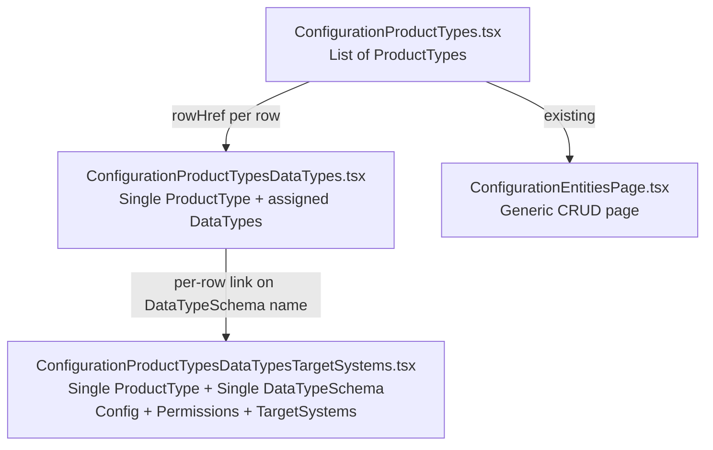
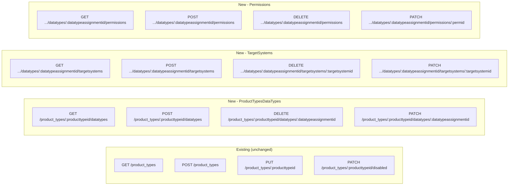

# Product Types UI — Implementation Concept

> Generated after resolving 12 specification gaps. Revised per feedback (2026-06-25).

---

## 1. Data Model (Already Defined in Schema)

### 1.1 `ProductTypesDataTypes` — DataTypeSchema Assignment to ProductType
**File:** [`src/schema/ProductTypeSchema.ts`](../src/schema/ProductType.ts:25-40)

| Column | Type | Nullable | Semantics |
|---|---|---|---|
| `identifier` | uuid (PK, uuidv7) | NOT NULL | Auto-generated |
| `productType` | uuid (FK→ProductTypes) | NOT NULL | Which product type |
| `dataType` | uuid (FK→DataTypeSchema) | NOT NULL | Which data type |
| `mandatory` | boolean | **NULLABLE** | null=inherit from DataTypeSchema, true=override yes, false=override no |
| `requestorCanEdit` | boolean | **NULLABLE** | null=inherit, true=override yes, false=override no |
| `editableOnUpdate` | boolean | NOT NULL (default true) | Two-state simple boolean |
| `config` | jsonb | NULLABLE | null=inherit from DataTypeSchema; keys null=inherit per-key |
| `owner` | uuid (FK→BusinessDomains) | NULLABLE | null=inherit from DataTypeSchema |

Unique constraint: `(productType, dataType)`

### 1.2 `ProductTypesDataTypesTargetSystems` — TargetSystem per DataTypeSchema Assignment
**File:** [`src/schema/ProductTypeSchema.ts`](../src/schema/ProductType.ts:42-53)

| Column | Type | Nullable | Semantics |
|---|---|---|---|
| `productType` | uuid (FK→ProductTypes) | NOT NULL | Composite PK part 1 |
| `dataType` | uuid (FK→DataTypeSchema) | NOT NULL | Composite PK part 2 |
| `targetSystem` | uuid (FK→TargetSystems) | NOT NULL | Composite PK part 3 |
| `name` | text | NULLABLE | null=use TargetSystem.name |

Unique constraint: `(productType, dataType, targetSystem)`

### 1.3 `ProductTypesDataTypePermission` — Group Permission per DataTypeSchema Assignment
**File:** [`src/schema/ProductTypeSchema.ts`](../src/schema/ProductType.ts:55-69)

| Column | Type | Nullable | Semantics |
|---|---|---|---|
| `productTypeDataTypeIdentifier` | uuid (FK→ProductTypesDataTypes.identifier) | NOT NULL | Links to the assignment row |
| `groupIdentifier` | uuid (FK→Group) | NOT NULL | Which group |
| `role` | text (viewer/writer/approver) | NOT NULL | DataTypeGroupRoles |
| `createdAt` | timestamp | NOT NULL | Audit |
| `createdBy` | uuid (FK→User) | NOT NULL | Audit |
| `showByDefault` | boolean | NOT NULL (default true) | Only for viewer role |

Unique constraint: `(productTypeDataTypeIdentifier, groupIdentifier, role)`

---

## 2. PubSub Channels

All defined in [`src/types/ProductTypeType.ts`](../src/types/ProductTypeType.ts) alongside existing channels.

| Channel Constant | Channel String | Emitted On |
|---|---|---|
| `message_AssignProductTypeDataType` | `assign.ProductTypeDataType` | POST assign DataTypeSchema |
| `message_UnassignProductTypeDataType` | `unassign.ProductTypeDataType` | DELETE unassign DataTypeSchema |
| `message_UpdateProductTypeDataType` | `update.ProductTypeDataType` | PATCH update assignment fields |
| `message_AssignProductTypeDataTypeTargetSystem` | `assign.ProductTypeDataTypeTargetSystem` | POST assign TargetSystem |
| `message_UnassignProductTypeDataTypeTargetSystem` | `unassign.ProductTypeDataTypeTargetSystem` | DELETE unassign TargetSystem |
| `message_UpdateProductTypeDataTypeTargetSystem` | `update.ProductTypeDataTypeTargetSystem` | PATCH update target system name |
| `message_GrantProductTypeDataTypePermission` | `grant.ProductTypeDataTypePermission` | POST grant permission |
| `message_RevokeProductTypeDataTypePermission` | `revoke.ProductTypeDataTypePermission` | DELETE revoke permission |
| `message_UpdateProductTypeDataTypePermission` | `update.ProductTypeDataTypePermission` | PATCH update showByDefault |

---

## 3. TypeBox Schemas & TypeScript Types

All added to [`src/types/ProductTypeType.ts`](../src/types/ProductTypeType.ts).

### 3.1 Design Principle: Derive Schemas from Drizzle Models

**All TypeBox schemas MUST be derived from the Drizzle-ORM table definitions** using `createSelectSchema()` and `createInsertSchema()` from `drizzle-typebox`, plus TypeBox modifiers (`Type.Partial`, `Type.Pick`, `Type.Omit`, `Static<>`). This ensures a single source of truth: changing the Drizzle column definition automatically propagates to all derived schemas and types.

```typescript
import { createInsertSchema, createSelectSchema } from "drizzle-typebox";
import { Type, type Static } from "@sinclair/typebox";
import { ProductTypesDataTypes, ProductTypesDataTypesTargetSystems, ProductTypesDataTypePermission } from "@/schema/ProductTypeSchema.ts";
```

### 3.2 Base Schemas & Types

```typescript
// --- ProductTypesDataTypes ---
export const ProductTypesDataTypeSelectSchema = Type.Object(createSelectSchema(ProductTypesDataTypes).properties);
export const ProductTypesDataTypeInsertSchema = Type.Object(createInsertSchema(ProductTypesDataTypes).properties);
export type ProductTypesDataType = Static<typeof ProductTypesDataTypeSelectSchema>;
export type NewProductTypesDataType = Static<typeof ProductTypesDataTypeInsertSchema>;

// --- ProductTypesDataTypesTargetSystems ---
export const ProductTypesDataTypesTargetSystemSelectSchema = Type.Object(createSelectSchema(ProductTypesDataTypesTargetSystems).properties);
export const ProductTypesDataTypesTargetSystemInsertSchema = Type.Object(createInsertSchema(ProductTypesDataTypesTargetSystems).properties);
export type ProductTypesDataTypesTargetSystem = Static<typeof ProductTypesDataTypesTargetSystemSelectSchema>;
export type NewProductTypesDataTypesTargetSystem = Static<typeof ProductTypesDataTypesTargetSystemInsertSchema>;

// --- ProductTypesDataTypePermission ---
export const ProductTypesDataTypePermissionSelectSchema = Type.Object(createSelectSchema(ProductTypesDataTypePermission).properties);
export const ProductTypesDataTypePermissionInsertSchema = Type.Object(createInsertSchema(ProductTypesDataTypePermission).properties);
export type ProductTypesDataTypePermission = Static<typeof ProductTypesDataTypePermissionSelectSchema>;
export type NewProductTypesDataTypePermission = Static<typeof ProductTypesDataTypePermissionInsertSchema>;
```

### 3.3 Composite Response Types

```typescript
/** ProductTypesDataTypes joined with DataTypeSchema name/kind/description and owner BusinessDomain name. */
export type ProductTypeDataTypeWithDetails = ProductTypesDataType & {
    dataTypeName: string;
    dataTypeKind: string;
    dataTypeDescription: string | null;
    ownerBusinessDomainName: string | null;
};

/** ProductTypesDataTypesTargetSystems joined with TargetSystem name. */
export type ProductTypeDataTypeTargetSystemWithDetails = ProductTypesDataTypesTargetSystem & {
    targetSystemName: string;
};

/** ProductTypesDataTypePermission joined with Group name. */
export type ProductTypeDataTypePermissionWithGroup = ProductTypesDataTypePermission & {
    groupName: string;
};
```

### 3.4 Request/Response Schemas (ElysiaJS Eden)

**Derived from insert schemas** via `Type.Partial` / `Type.Pick` / `Type.Omit` — never hand-written.

```typescript
// PATCH body for ProductTypesDataTypes — all mutable fields, all optional
// Omits immutable columns (identifier, productType, dataType) from the insert schema,
// then wraps with Partial so every field is optional.
export const UpdateProductTypeDataTypeBodySchema = Type.Partial(Type.Omit(
    ProductTypesDataTypeInsertSchema,
    ["identifier", "productType", "dataType"],
));

// POST body for ProductTypesDataTypePermission — fields the client must provide
export const GrantProductTypeDataTypePermissionBodySchema = Type.Pick(
    ProductTypesDataTypePermissionInsertSchema,
    ["groupIdentifier", "role"],
);
// Note: showByDefault is optional on the client; createdAt and createdBy are set server-side.

// DELETE body for ProductTypesDataTypePermission
export const RevokeProductTypeDataTypePermissionBodySchema = Type.Pick(
    ProductTypesDataTypePermissionInsertSchema,
    ["groupIdentifier", "role"],
);

// PATCH body for ProductTypesDataTypePermission — only showByDefault is mutable
export const UpdateProductTypeDataTypePermissionBodySchema = Type.Pick(
    ProductTypesDataTypePermissionInsertSchema,
    ["showByDefault"],
);
```

---

## 4. Repository Layer (`src/repo/ProductTypeRepo.ts`)

**IMPORTANT:** The existing CRUD for `ProductTypes` (the main table) **MUST NOT be modified**. All new code is additive.

### 4.1 ProductTypesDataTypes CRUD

```typescript
import type { NewProductTypesDataType, ProductTypesDataType } from "@/types/ProductTypeType.ts";

// GET: list all DataTypes assigned to a ProductType (joined with DataTypeSchema name/kind/description)
async function getDataTypes(db: DBClient, productTypeIdentifier: UUIDType): Promise<ProductTypeDataTypeWithDetails[]>;

// POST: assign a DataTypeSchema to a ProductType
async function assignDataType(db: DBClient, user: UserType, productTypeIdentifier: UUIDType, dataTypeIdentifier: UUIDType): Promise<ProductTypesDataType[]>;

// DELETE: unassign a DataTypeSchema from a ProductType
async function unassignDataType(db: DBClient, assignmentIdentifier: UUIDType): Promise<ProductTypesDataType[]>;

// PATCH: update assignment fields. Uses Omit to discard immutable columns.
// fields: Omit<NewProductTypesDataType, "identifier" | "productType" | "dataType">
// This means: all columns from the insert schema MINUS the three identifiers.
// Benefits: future columns added to the Drizzle schema automatically become updatable.
async function updateDataTypeAssignment(
    db: DBClient,
    user: UserType,
    assignmentIdentifier: UUIDType,
    fields: Partial<Omit<NewProductTypesDataType, "identifier" | "productType" | "dataType">>,
): Promise<ProductTypesDataType[]>;

// GET single: get one assignment by identifier
async function getDataTypeAssignment(db: DBClient, assignmentIdentifier: UUIDType): Promise<ProductTypesDataType | null>;
```

All mutating functions publish to the appropriate PubSub channel via `PubSub.publish()`.

### 4.2 ProductTypesDataTypesTargetSystems CRUD

```typescript
// GET: list all TargetSystems assigned to a ProductType+DataTypeSchema assignment (joined with name)
async function getTargetSystems(db: DBClient, productTypeIdentifier: UUIDType, dataTypeIdentifier: UUIDType): Promise<ProductTypeDataTypeTargetSystemWithDetails[]>;

// POST: assign a TargetSystem
async function assignTargetSystem(db: DBClient, productTypeIdentifier: UUIDType, dataTypeIdentifier: UUIDType, targetSystemIdentifier: UUIDType): Promise<ProductTypesDataTypesTargetSystem[]>;

// DELETE: unassign a TargetSystem
async function unassignTargetSystem(db: DBClient, productTypeIdentifier: UUIDType, dataTypeIdentifier: UUIDType, targetSystemIdentifier: UUIDType): Promise<ProductTypesDataTypesTargetSystem[]>;

// PATCH: update mutable fields. Uses Omit to discard immutable columns.
// fields: Omit<NewProductTypesDataTypesTargetSystem, "productType" | "dataType" | "targetSystem">
// Currently only "name" remains (the table's sole mutable column), but the Omit
// pattern makes the function robust — future columns added to the Drizzle schema
// automatically become updatable without changing this signature.
async function updateTargetSystemAssignment(
    db: DBClient,
    productTypeIdentifier: UUIDType,
    dataTypeIdentifier: UUIDType,
    targetSystemIdentifier: UUIDType,
    fields: Partial<Omit<NewProductTypesDataTypesTargetSystem, "productType" | "dataType" | "targetSystem">>,
): Promise<ProductTypesDataTypesTargetSystem[]>;
```

### 4.3 ProductTypesDataTypePermission CRUD

Pattern mirrors [`DataTypeRepo.getPermissions/grantPermission/revokePermission/updatePermission`](../src/repo/DataTypeRepo.ts:89-173).

```typescript
// GET: list all permissions for a ProductType+DataTypeSchema assignment
async function getPermissions(db: DBClient, assignmentIdentifier: UUIDType): Promise<ProductTypeDataTypePermissionWithGroup[]>;

// POST: grant a group+role (upsert on conflict)
async function grantPermission(db: DBClient, user: UserType, assignmentIdentifier: UUIDType, groupIdentifier: UUIDType, role: DataTypeGroupRoles, showByDefault?: boolean): Promise<ProductTypesDataTypePermission[]>;

// DELETE: revoke a group+role
async function revokePermission(db: DBClient, assignmentIdentifier: UUIDType, groupIdentifier: UUIDType, role: string): Promise<ProductTypesDataTypePermission[]>;

// PATCH: update mutable fields. Uses Omit to discard immutable columns.
// fields: Omit<NewProductTypesDataTypePermission, "productTypeDataTypeIdentifier" | "groupIdentifier" | "role" | "createdAt" | "createdBy">
// Currently only "showByDefault" remains; future columns automatically become updatable.
async function updatePermission(
    db: DBClient,
    assignmentIdentifier: UUIDType,
    groupIdentifier: UUIDType,
    role: DataTypeGroupRoles,
    fields: Partial<Omit<NewProductTypesDataTypePermission, "productTypeDataTypeIdentifier" | "groupIdentifier" | "role" | "createdAt" | "createdBy">>,
): Promise<ProductTypesDataTypePermission[]>;
```

---

## 5. API Layer (`src/api/ProductTypesAPI.ts`)

**IMPORTANT:** The existing CRUD endpoints for `ProductTypes` (the main table) generated via `registerConfigurationEntityRoutes` **MUST NOT be modified**. All new routes are additive.

### 5.0 Factory Evaluation

The `registerConfigurationEntityRoutes` factory (from [`_crud_API.ts`](../src/api/_crud_API.ts)) is **not usable** for the sub-resource endpoints because:

1. **Type constraint**: `TRecord extends BaseColumnsNamedSelectType` — the sub-tables lack `name` and `disabled` columns.
2. **Route structure**: The factory generates top-level routes (`GET /basePath`, `PUT /basePath/:id`), but our sub-resources are nested under `/product_types/:producttypeid/`.
3. **Semantics**: The factory assumes a `ConfigurationEntityRepo` with `count`, `disable`, `enable` — the sub-tables have different lifecycle semantics (assignment/unassignment and permission grant/revoke).

**Decision**: All sub-resource routes are implemented as custom Elysia handlers following the pattern established in [`DataTypesAPI.ts`](../src/api/DataTypesAPI.ts:86-243) for permissions. Each handler performs auth, validates input, delegates to the repo, and wraps responses in the standard paginated format.

### 5.1 ProductTypesDataTypes Endpoints

| Method | Path | Description |
|---|---|---|
| GET | `/product_types/:producttypeid/datatypes` | List assigned DataTypes (joined with name/kind/description). Paginated response with `page`, `pageSize`, `total`, `availablePageSizes`. |
| POST | `/product_types/:producttypeid/datatypes` | Assign a DataTypeSchema. Body: `{ dataTypeIdentifier: string }` |
| DELETE | `/product_types/:producttypeid/datatypes/:datatypeassignmentid` | Unassign a DataTypeSchema |
| PATCH | `/product_types/:producttypeid/datatypes/:datatypeassignmentid` | Update assignment fields. Body: `UpdateProductTypeDataTypeBodySchema` |

Auth: `FP_VIEW_PRODUCT_TYPES` for GET, `FP_MANAGE_PRODUCT_TYPES` for mutations.

### 5.2 ProductTypesDataTypesTargetSystems Endpoints

| Method | Path | Description |
|---|---|---|
| GET | `/product_types/:producttypeid/datatypes/:datatypeassignmentid/targetsystems` | List assigned TargetSystems (joined with name). Paginated response. |
| POST | `/product_types/:producttypeid/datatypes/:datatypeassignmentid/targetsystems` | Assign a TargetSystem. Body: `{ targetSystemIdentifier: string }` |
| DELETE | `/product_types/:producttypeid/datatypes/:datatypeassignmentid/targetsystems/:targetsystemid` | Unassign a TargetSystem |
| PATCH | `/product_types/:producttypeid/datatypes/:datatypeassignmentid/targetsystems/:targetsystemid` | Update name override. Body: `{ name: string | null }` |

### 5.3 ProductTypesDataTypePermission Endpoints

| Method | Path | Description |
|---|---|---|
| GET | `/product_types/:producttypeid/datatypes/:datatypeassignmentid/permissions` | List permissions (joined with group name) |
| POST | `/product_types/:producttypeid/datatypes/:datatypeassignmentid/permissions` | Grant a group+role. Body: `GrantProductTypeDataTypePermissionBodySchema` |
| DELETE | `/product_types/:producttypeid/datatypes/:datatypeassignmentid/permissions` | Revoke a group+role. Body: `RevokeProductTypeDataTypePermissionBodySchema` |
| PATCH | `/product_types/:producttypeid/datatypes/:datatypeassignmentid/permissions/:permid` | Update showByDefault. Body: `UpdateProductTypeDataTypePermissionBodySchema` |

The `permid` encodes `groupIdentifier__role` (same pattern as DataTypeSchema permissions).

### 5.4 OpenAPI Documentation

All custom routes MUST include `detail: { tags: [...], summary: "...", description: "..." }` for LLM-compatible API documentation. Follow the pattern in [`DataTypesAPI.ts`](../src/api/DataTypesAPI.ts:100-107).

---

## 6. Frontend API Client (`src/ui/api/ProductTypes.ts`)

New functions to add alongside the existing `getProductTypes`, `createProductType`, etc.:

```typescript
import { apiGet, apiPost, apiDelete, apiPatch } from "./index.ts";

// --- ProductTypesDataTypes ---
export async function getProductTypeDataTypes(
    productTypeIdentifier: string,
    page: number,
    pageSize: number,
): Promise<ProductTypeDataTypesResponse>;

export async function assignDataType(
    productTypeIdentifier: string,
    dataTypeIdentifier: string,
): Promise<ProductTypeDataTypeAssignmentResponse>;

export async function unassignDataType(
    productTypeIdentifier: string,
    assignmentIdentifier: string,
): Promise<void>;

export async function updateDataTypeAssignment(
    productTypeIdentifier: string,
    assignmentIdentifier: string,
    data: Static<typeof UpdateProductTypeDataTypeBodySchema>,
): Promise<ProductTypeDataTypeAssignmentResponse>;

// --- ProductTypesDataTypesTargetSystems ---
export async function getProductTypeDataTypeTargetSystems(
    productTypeIdentifier: string,
    assignmentIdentifier: string,
    page: number,
    pageSize: number,
): Promise<ProductTypeDataTypeTargetSystemsResponse>;

export async function assignTargetSystem(
    productTypeIdentifier: string,
    assignmentIdentifier: string,
    targetSystemIdentifier: string,
): Promise<ProductTypeDataTypeTargetSystemAssignmentResponse>;

export async function unassignTargetSystem(
    productTypeIdentifier: string,
    assignmentIdentifier: string,
    targetSystemIdentifier: string,
): Promise<void>;

export async function updateTargetSystemAssignment(
    productTypeIdentifier: string,
    assignmentIdentifier: string,
    targetSystemIdentifier: string,
    name: string | null,
): Promise<ProductTypeDataTypeTargetSystemAssignmentResponse>;

// --- ProductTypesDataTypePermission ---
export async function getProductTypeDataTypePermissions(
    productTypeIdentifier: string,
    assignmentIdentifier: string,
): Promise<ProductTypeDataTypePermissionsResponse>;

export async function grantProductTypeDataTypePermission(
    productTypeIdentifier: string,
    assignmentIdentifier: string,
    data: { groupIdentifier: string; role: string; showByDefault?: boolean },
): Promise<ProductTypeDataTypePermissionGrantResponse>;

export async function revokeProductTypeDataTypePermission(
    productTypeIdentifier: string,
    assignmentIdentifier: string,
    data: { groupIdentifier: string; role: string },
): Promise<void>;

export async function updateProductTypeDataTypePermission(
    productTypeIdentifier: string,
    assignmentIdentifier: string,
    permId: string,
    data: { showByDefault: boolean },
): Promise<ProductTypeDataTypePermissionGrantResponse>;
```

### 6.1 Request Bundling

All mutating calls use `apiPost`, `apiPatch`, and `apiDelete` from [`src/ui/api/index.ts`](../src/ui/api/index.ts). These primitives automatically route through the request-bundling queue ([`src/ui/api/_request_bundling.ts`](../src/ui/api/_request_bundling.ts)), which batches mutations into a single HTTP POST to `/api/request_bundling`. No extra configuration is needed — using `apiPost`/`apiPatch`/`apiDelete` is sufficient.

Read calls (`apiGet`) bypass bundling as direct `fetch()` calls.

---

## 7. Frontend Pages

### 7.1 [`ConfigurationProductTypes.tsx`](../src/ui/pages/ConfigurationProductTypes.tsx) — Add Link Column

The existing page uses `createConfigurationEntityPage()` → `_configuration_entity_page_factory.tsx` → `ConfigurationEntitiesPage.tsx`.

[`ConfigurationEntitiesPage`](../src/ui/pages/ConfigurationEntitiesPage.tsx:36-41) already supports `rowHref` (makes the entire row a clickable link) and `renderExtraCells` (adds custom `<td>` columns). However, [`createConfigurationEntityPage`](../src/ui/pages/_configuration_entity_page_factory.tsx) does not expose these props.

**Approach:** Extend `ConfigurationEntityPageDefinition` and `createConfigurationEntityPage` in [`_configuration_entity_page_factory.tsx`](../src/ui/pages/_configuration_entity_page_factory.tsx) to accept and forward:
- `rowHref?: (row: T) => string`
- `renderExtraCells?: (row: T) => React.ReactNode[]`

Then in [`ConfigurationProductTypes.tsx`](../src/ui/pages/ConfigurationProductTypes.tsx:35), pass:

```typescript
rowHref: (row) => `/configuration/product-types/${row.identifier}/datatypes`,
```

This makes each product type row clickable — navigating to the detail/datatypes page.

### 7.2 [`ConfigurationProductTypesDataTypes.tsx`](../src/ui/pages/ConfigurationProductTypesDataTypes.tsx) — NEW

**Route:** `/configuration/product-types/:producttypeid/datatypes`

**Sections:**

#### A. ProductType Metadata (Header)
- Display/Edit: `name` and `description` (inline editable with save/restore, pattern from `SaveRestoreField` in DataTypeSchema detail)
- Display (read-only): `identifier`, `createdAt`/`createdBy`, `updatedAt`/`updatedBy`, `disabled`/`enabled` toggle
- Pattern source: [`ConfigurationDataTypeDetail.tsx` Metadata section](../src/ui/pages/ConfigurationDataTypeDetail.tsx:1138-1265)
- Use `updateProductType()` API for name/description edits (existing function)
- Use `setProductTypeDisabled()` for toggle (existing function)

#### B. Assign DataTypeSchema Button + Dialog
- Button: "Assign Data Type" with `pi-plus` icon
- Dialog: Paginated list/table of available DataTypes (from `getDataTypes()` with pagination parameters)
  - Display: `dataType.name`, `dataType.kind`, and `dataType.description` for each option
  - Filter out already-assigned DataTypes on the client side
  - Pagination controls match the pattern in [`ConfigurationProductTypes.tsx`](../src/ui/pages/ConfigurationProductTypes.tsx)
- On confirm: calls `assignDataType()`

#### C. Assigned DataTypes Table
Columns:

| Column | Source | Editable | Widget |
|---|---|---|---|
| DataTypeSchema Name | `dataTypeName` (joined) | No | Read-only, clickable link → targetsystems page |
| DataTypeSchema Kind | `dataTypeKind` (joined) | No | Read-only |
| Owner | `owner` | Yes | Dropdown of BusinessDomains, immediate save on change |
| Mandatory | `mandatory` | Yes | Tri-state: click to cycle Yes → No → Parent, immediate save |
| Editable on Update | `editableOnUpdate` | Yes | Two-state `InputSwitch`, immediate save on toggle |
| Requestor Can Edit | `requestorCanEdit` | Yes | Tri-state: click to cycle Yes → No → Parent, immediate save |
| Action | — | Yes | Delete button (pi-trash icon), calls `unassignDataType()` |

For tri-state columns (Mandatory, Requestor Can Edit):
- Render as: Yes (green chip) / No (red chip) / Parent (gray, italic "from DataTypeSchema")
- **Click to cycle**: Yes → No → Parent → Yes (three states)
- **On change: immediate PATCH** via `updateDataTypeAssignment()`

For two-state columns (Editable on Update):
- Render as `InputSwitch` toggle
- **On toggle: immediate PATCH** via `updateDataTypeAssignment()`

For Owner column:
- Dropdown of BusinessDomains loaded from `getBusinessDomains()`
- **On change: immediate PATCH** via `updateDataTypeAssignment()`

Each row's DataTypeSchema Name is a `<Link>` to:
```
/configuration/product-types/:producttypeid/datatypes/:datatypeassignmentid/targetsystems
```

#### D. PubSub Subscriptions
Subscribe to `assign.ProductTypeDataType`, `unassign.ProductTypeDataType`, `update.ProductTypeDataType` to refresh the table.

#### E. Page Registration
Register in [`src/ui/app_PageRegistry.ts`](../src/ui/app_PageRegistry.ts) and [`src/ui/PageRegistry.ts`](../src/ui/PageRegistry.ts).

Required permissions: `FP_DO_CONFIGURATION` + `FP_VIEW_PRODUCT_TYPES`.

---

### 7.3 [`ConfigurationProductTypesDataTypesTargetSystems.tsx`](../src/ui/pages/ConfigurationProductTypesDataTypesTargetSystems.tsx) — NEW

**Route:** `/configuration/product-types/:producttypeid/datatypes/:datatypeassignmentid/targetsystems`

**Sections:**

#### A. Header — ProductType & DataTypeSchema Info (Read-only)
Display:
- ProductType.name, ProductType.description
- DataTypeSchema.name, DataTypeSchema.kind, DataTypeSchema.description

(All fetched via the joined response type `ProductTypeDataTypeWithDetails` which now includes `dataTypeDescription` — see section 3.3.)

#### B. Assignment Details (Editable)
Display AND allow editing:
- Owner (dropdown of BusinessDomains, immediate save on change)
- Mandatory (tri-state, click to cycle Yes/No/Parent, immediate save on change)
- Editable on Update (two-state InputSwitch, immediate save on toggle)
- Requestor Can Edit (tri-state, click to cycle, immediate save on change)

Pattern: Same as the columns in 7.2.C, but displayed as labeled fields with the same immediate-save behavior.

#### C. Configuration Section (Config Editor)
- Pattern source: [`ConfigurationDataTypeDetail.tsx` Config section](../src/ui/pages/ConfigurationDataTypeDetail.tsx:1267-1279)
- Display the `config` JSON from `ProductTypesDataTypes.config`
- Use Monaco editor (`Editor` from `@monaco-editor/react`) for editing
- Include Save/Restore/Clear buttons (pattern from `MonacoField`)
- On save: PATCH via `updateDataTypeAssignment()`

#### D. Permissions Section
- Extract **`PermissionChipManager`** to a shared component at [`src/ui/components/PermissionChipManager.tsx`](../src/ui/components/) (see section 12).
- Both [`ConfigurationDataTypeDetail.tsx`](../src/ui/pages/ConfigurationDataTypeDetail.tsx) and this page import from the shared location.
- Three panels: Viewer, Writer, Approver
- Load groups from `/api/groups` (same as DataTypeSchema detail)
- Grant: select group from dropdown, calls `grantProductTypeDataTypePermission()`
- Revoke: click × on chip, calls `revokeProductTypeDataTypePermission()`
- Toggle "show" checkbox for viewer role: calls `updateProductTypeDataTypePermission()`
- Use `permId()` pattern: `${groupIdentifier}__${role}`

#### E. Target Systems Section
- Button: "Assign Target System" with `pi-plus` icon, opens dialog
- Dialog: **Paginated** list/table of available TargetSystems (from `getTargetSystems()` with pagination)
  - Filter out already-assigned ones on the client side
  - Pagination controls match the pattern in [`ConfigurationProductTypes.tsx`](../src/ui/pages/ConfigurationProductTypes.tsx)
- Table columns:

| Column | Source | Editable | Widget |
|---|---|---|---|
| Target System Name | `targetSystemName` (joined) | No | Read-only |
| Name Override | `name` | Yes | InputText with save/revert buttons (`SaveRestoreField` pattern) |
| Action | — | Yes | Delete button (pi-trash icon), calls `unassignTargetSystem()` |

Name override uses `SaveRestoreField` pattern from [`ConfigurationDataTypeDetail.tsx`](../src/ui/pages/ConfigurationDataTypeDetail.tsx:255-298).

#### F. PubSub Subscriptions
Subscribe to:
- `update.ProductTypeDataType` (for owner/mandatory/etc changes)
- `grant.ProductTypeDataTypePermission`, `revoke.ProductTypeDataTypePermission`, `update.ProductTypeDataTypePermission`
- `assign.ProductTypeDataTypeTargetSystem`, `unassign.ProductTypeDataTypeTargetSystem`, `update.ProductTypeDataTypeTargetSystem`

#### G. Page Registration
Register in [`src/ui/app_PageRegistry.ts`](../src/ui/app_PageRegistry.ts) and [`src/ui/PageRegistry.ts`](../src/ui/PageRegistry.ts).

Required permissions: `FP_DO_CONFIGURATION` + `FP_VIEW_PRODUCT_TYPES`.

---

## 8. Implementation Order

Files to create or modify, in dependency order:

### Phase 1: Types & Schemas
1. **MODIFY** [`src/types/ProductTypeType.ts`](../src/types/ProductTypeType.ts) — Add all new types, schemas, and PubSub constants (sections 2, 3)

### Phase 2: Repository Layer
2. **MODIFY** [`src/repo/ProductTypeRepo.ts`](../src/repo/ProductTypeRepo.ts) — Add all new repository functions (section 4; DO NOT modify existing ProductType CRUD)

### Phase 3: API Layer
3. **MODIFY** [`src/api/ProductTypesAPI.ts`](../src/api/ProductTypesAPI.ts) — Add all new Elysia route handlers (section 5; DO NOT modify existing `registerConfigurationEntityRoutes` call)

### Phase 4: Frontend API Client
4. **MODIFY** [`src/ui/api/ProductTypes.ts`](../src/ui/api/ProductTypes.ts) — Add all new API client functions (section 6)

### Phase 5: Shared Components
5. **CREATE** [`src/ui/components/PermissionChipManager.tsx`](../src/ui/components/PermissionChipManager.tsx) — Extract from `ConfigurationDataTypeDetail.tsx` (section 12)
6. **CREATE** [`design/components.md`](../design/components.md) — Document plan to extract `SaveRestoreField` as shared component (section 12)

### Phase 6: Frontend Pages & Factory
7. **MODIFY** [`src/ui/pages/_configuration_entity_page_factory.tsx`](../src/ui/pages/_configuration_entity_page_factory.tsx) — Extend to accept `rowHref` and `renderExtraCells`
8. **MODIFY** [`src/ui/pages/ConfigurationProductTypes.tsx`](../src/ui/pages/ConfigurationProductTypes.tsx) — Add `rowHref` for detail link
9. **CREATE** [`src/ui/pages/ConfigurationProductTypesDataTypes.tsx`](../src/ui/pages/ConfigurationProductTypesDataTypes.tsx) — New page (section 7.2)
10. **CREATE** [`src/ui/pages/ConfigurationProductTypesDataTypesTargetSystems.tsx`](../src/ui/pages/ConfigurationProductTypesDataTypesTargetSystems.tsx) — New page (section 7.3)

### Phase 7: Page Registry
11. **MODIFY** [`src/ui/app_PageRegistry.ts`](../src/ui/app_PageRegistry.ts) — Import and register new pages
12. **MODIFY** [`src/ui/PageRegistry.ts`](../src/ui/PageRegistry.ts) — Register new pages

---

## 9. Key Design Decisions Summary

| # | Decision | Rationale |
|---|---|---|
| 1 | 9 PubSub channels (not 3) | One per CRUD operation on each sub-table |
| 2 | Custom repo functions (not factory) | Sub-tables lack `baseColumnsNamed`; `ConfigurationEntityRepo` type incompatible |
| 3 | Custom Elysia routes (not factory) | Nested paths and different semantics; factory evaluated and rejected (see 5.0) |
| 4 | API paths use `datatypeassignmentid` | Identifies the `ProductTypesDataTypes` row |
| 5 | Config editing on targetsystems page | First level = assignment overview; second level = detailed config |
| 6 | Tri-state for mandatory/requestorCanEdit | null = inherit from DataTypeSchema; click to cycle Yes→No→Parent |
| 7 | Two-state for editableOnUpdate | NOT NULL column, simple boolean InputSwitch |
| 8 | PATCH uses `Omit<T>` not `Pick<T>` | Future columns automatically become updatable |
| 9 | Reuse FP_MANAGE_PRODUCT_TYPES / FP_VIEW_PRODUCT_TYPES | Simple, consistent with DataTypeSchema sub-resource pattern |
| 10 | Immediate save on inline edits | Consistent with DataTypeSchema detail page dropdowns |
| 11 | All types in ProductTypeType.ts | Single source of truth for ProductType domain |
| 12 | TypeBox schemas derived from Drizzle | `createSelectSchema`/`createInsertSchema` + TypeBox modifiers; never hand-written |
| 13 | Request bundling via `apiPost`/`apiPatch`/`apiDelete` | Automatic — no extra configuration needed |
| 14 | Paginated DataTypeSchema/TargetSystem picker dialogs | Consistent with the list pages |
| 15 | Migrations handled manually by user | Not part of this implementation |

---

## 10. Mermaid: Page Navigation Flow



## 11. Mermaid: API Route Structure



---

## 12. Shared Component Extraction

### 12.1 PermissionChipManager

**Extract to:** [`src/ui/components/PermissionChipManager.tsx`](../src/ui/components/PermissionChipManager.tsx)

Move the `PermissionChipManager` component (currently at line 304 of [`ConfigurationDataTypeDetail.tsx`](../src/ui/pages/ConfigurationDataTypeDetail.tsx:304)) to the shared components directory. Both `ConfigurationDataTypeDetail.tsx` and `ConfigurationProductTypesDataTypesTargetSystems.tsx` will import it from the shared location.

The component should accept props:
```typescript
{
    label: string;
    role: string;
    allGroups: { identifier: string; name: string }[];
    assignedPermissions: { groupIdentifier: string; groupName: string; role: string; showByDefault: boolean; createdAt: string }[];
    onGrant: (groupIdentifier: string) => Promise<void>;
    onRevoke: (groupIdentifier: string) => Promise<void>;
    onToggleShowByDefault: (entry: ...) => Promise<void>;
    canManage: boolean;
}
```

### 12.2 SaveRestoreField — Future Extraction

**Document plan at:** [`design/components.md`](../design/components.md)

Create a short document noting that `SaveRestoreField` (currently at line 255 of [`ConfigurationDataTypeDetail.tsx`](../src/ui/pages/ConfigurationDataTypeDetail.tsx:255)) should be extracted to `src/ui/components/` as a shared component. Its implementation is **not** part of this product-types concept; it will be done separately. Both the product-types pages and the data-type detail page can then import it from the shared location.
