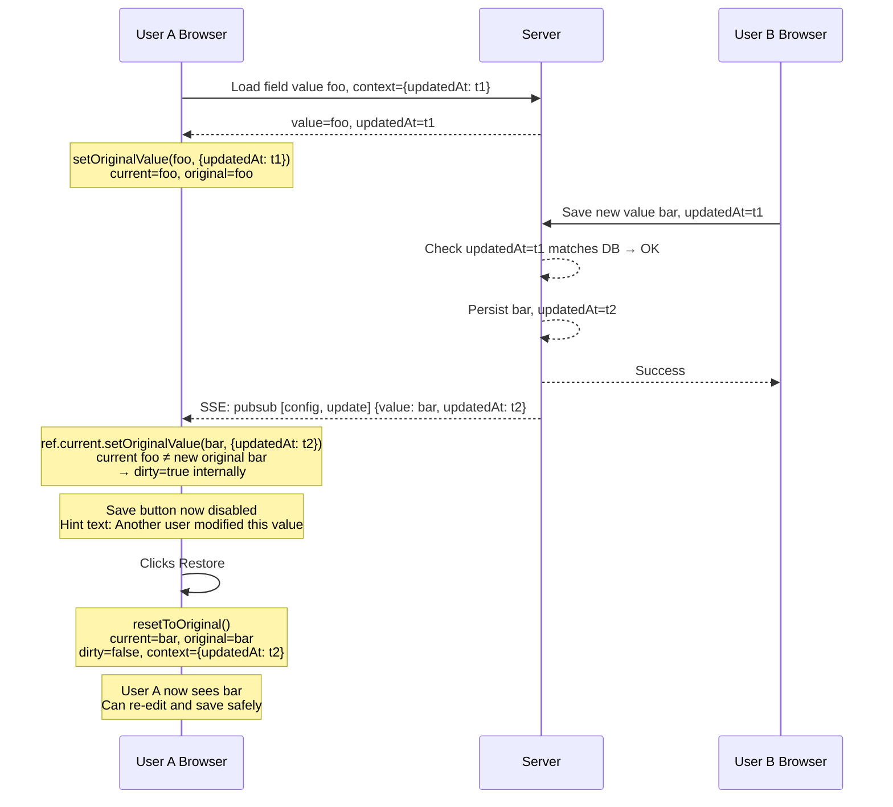

# InputField Component

## Overview

The `InputField` component is a reusable, controlled form input for inline editing within the admin UI. It wraps PrimeReact's [`InputText`](https://primereact.org/inputtext/) and [`InputTextarea`](https://primereact.org/inputtextarea/) components, adding Save/Restore button affordances, real-time input formatting/masking, hint text display, and a concurrency-aware dirty-flag system that integrates with the application's PubSub/SSE infrastructure.

The component exposes a fully **imperative, ref-based API** via `forwardRef` + `useImperativeHandle`. Parent components interact with it exclusively through the `InputFieldHandle` interface rather than through React state props, enabling fine-grained control over value lifecycle, button enablement, and concurrent-modification signaling.

## Design Goals

- **Imperative control.** Parent components read and mutate the field state through a typed ref handle, not through React prop/state round-trips. This keeps the parent free of re-render churn on every keystroke.
- **Inline editing affordances.** Save and Restore buttons appear contextually (only when the field has focus and the value has changed), with clear visual states for disabled/dirty conditions.
- **Concurrency safety.** The dirty-flag/`context` mechanism (which typically carries `updatedAt` for optimistic locking) prevents overwriting changes made by another user or process while the current user is editing. This integrates with the PubSub/SSE system described in [`design/pubsub.md`](../pubsub.md) and [`design/server-sent-events.md`](../server-sent-events.md).
- **Pluggable formatting.** Input masking is handled by a swappable `InputFormatter` function. Built-in formatters for common patterns (currency, percentage, digits, IPv4, UUID) are provided, and downstream projects can register custom formatters without modifying shipped files.
- **Single-line and multi-line modes.** The component renders either an `<InputText>` or `<InputTextarea>` based on the `multiLine` prop, sharing the same imperative API regardless of mode.

## Architecture

### Component Tree

```
InputField (forwardRef)
├── PrimeReact InputText          (when multiLine = false)
│   └── Native <input> element
├── PrimeReact InputTextarea      (when multiLine = true)
│   └── Native <textarea> element
├── Save Button                   (icon from saveButtonIcon prop, default pi-save; PrimeReact Button)
├── Restore Button                (icon from restoreButtonIcon prop, default pi-undo; PrimeReact Button)
└── Hint Text                     (plain inline element below the input)
```

The component renders **nothing** when `visible` is `false`.

### Imperative API Pattern

The component uses React's `forwardRef` to expose an `InputFieldHandle` via `useImperativeHandle`. The handle provides methods for reading and mutating the component's internal state without triggering parent re-renders:

```ts
// Parent usage
const fieldRef = useRef<InputFieldHandle>(null);

// Later, in an SSE callback:
fieldRef.current?.setDirty(true);
fieldRef.current?.setHintText("Another user modified this value.");
```

The component also accepts callback props (`onFocus`, `onBlur`, `onChange`, `onDirty`, `onSave`, `onTooltip`) that receive the `InputFieldHandle` as their first argument, allowing the parent to query the field state when an event fires.

### Relationship to Parent Components

A typical parent (e.g., a detail page or a config list row) holds a `ref` to each `InputField` instance. On mount, the parent calls `setOriginalValue(value, { updatedAt })` to seed the confirmed/original state. When the user saves (via button click or blur), the `onSave` callback fires with `(component, source)`. The parent calls `component.getCurrentValue()` to retrieve the new value and `component.getContext()` to obtain the stored context (including `updatedAt`). On success, the parent calls `component.setOriginalValue(newValue, { updatedAt: newUpdatedAt })` to confirm the change. If the API returns `409 Conflict` (optimistic lock failure), the parent calls `component.setDirty(true)` and `component.setHintText(...)`.

## Props

All props are passed as a single props object to the `forwardRef`-wrapped component.

| Prop | Type | Default | Description |
|------|------|---------|-------------|
| `editable` | `boolean` | `true` | When `false`, the input is rendered with `readOnly` (single-line) or `disabled` (multi-line), preventing user interaction. |
| `visible` | `boolean` | `true` | When `false`, the component renders nothing (`null`). |
| `passwordVisible` | `boolean` | `true` | When `false` and `multiLine` is `false`, the input `type` is `"password"` (masking the value). When `true` (default), the type is `"text"`. Ignored when `multiLine` is `true`. |
| `multiLine` | `boolean` | `false` | When `true`, renders a `<InputTextarea>` instead of `<InputText>`. |
| `showButtons` | `boolean` | `true` | Controls whether Save/Restore buttons **can** appear at all. When `false`, buttons are never rendered, even if all other visibility conditions are met. |
| `saveButtonEnabled` | `boolean` | `true` | Controls whether the Save button is in an **enabled** state. When `false` and the Save button is visible, it is disabled. Used to disable Save during an in-flight API mutation. |
| `restoreButtonEnabled` | `boolean` | `true` | Controls whether the Restore button is in an **enabled** state. When `false` and the Restore button is visible, it is disabled. |
| `placeholder` | `string` | `undefined` | Placeholder text for the input field, passed directly to the PrimeReact `InputText`/`InputTextarea` component. |
| `saveButtonIcon` | `string` | `"pi pi-save"` | CSS class(es) for the Save button icon. Override to use a custom PrimeIcons class. |
| `restoreButtonIcon` | `string` | `"pi pi-undo"` | CSS class(es) for the Restore button icon. Override to use a custom PrimeIcons class. |
| `onFocus` | `(component: InputFieldHandle) => void` | `undefined` | Called when the input gains focus. |
| `onBlur` | `(component: InputFieldHandle) => void` | `undefined` | Called when the input loses focus. |
| `onChange` | `(component: InputFieldHandle) => void` | `undefined` | Called when the input value changes (on each keystroke, after formatting is applied). |
| `onDirty` | `(component: InputFieldHandle) => void` | `undefined` | Called whenever the component's internal dirty status changes (either `true` → `false` or `false` → `true`). Useful for parent components to update hint text or UI state in response to dirty-state transitions. |
| `onSave` | `(component: InputFieldHandle, source: "button" \| "blur") => void` | `undefined` | Called when the Save button is clicked, or when the input loses focus while the value differs from the original (auto-save behavior). The `source` parameter distinguishes the trigger. |
| `onTooltip` | `(component: InputFieldHandle) => string \| undefined` | `undefined` | Called to retrieve tooltip text for the input field. If the callback returns `undefined` or an empty string, no tooltip is shown. The tooltip is displayed via the PrimeReact tooltip mechanism on the input element. |

### Props Not Exposed

The component deliberately does **not** expose `value`, `name`, `type`, `className`, or `style` as props. Rationale:

- **`value`**: Managed entirely through the imperative `setOriginalValue()` / `resetToOriginal()` API and internal keystroke state. Exposing a `value` prop would create a confusing dual-control surface.
- **`name`**: Not needed for the inline-editing use case. If a parent needs to distinguish multiple `InputField` instances in callbacks, it should use separate refs or closure-scoped identifiers.
- **`className`**, **`style`**: Can be added later if needed. The initial design keeps the surface minimal.
- **`type`**: The HTML input type is derived from `passwordVisible` and `multiLine` props. A general `type` prop can be added in the future for HTML5 input types like `"number"`, `"email"`, or `"url"`.

## Imperative API (`InputFieldHandle`)

The following methods are exposed on the ref handle returned by `useImperativeHandle`:

| Method | Signature | Description |
|--------|-----------|-------------|
| `setOriginalValue` | `(value: string, context?: Record<string, unknown>) => void` | Sets the confirmed/original value and an optional context object (e.g. `{ updatedAt }` for optimistic locking). If the current displayed value differs from the new original, sets `dirty = true` internally. The `context` parameter defaults to `{}`. This is called by the parent on initial load and after a successful save. |
| `getContext` | `() => Record<string, unknown> \| null` | Returns the context object stored by the last `setOriginalValue` call, or `null` if none has been set. The parent uses this to retrieve `updatedAt` (or any other contextual data) before persisting. |
| `getCurrentValue` | `() => string` | Returns the currently displayed (potentially edited) value from the input. |
| `compareWithOriginal` | `() => boolean` | Returns `true` if the current displayed value differs from the original value. |
| `setHintText` | `(text: string) => void` | Sets hint text displayed below the input field. Pass an empty string or `""` to hide the hint. |
| `enableSaveButton` | `() => void` | Enables the Save button (sets the internal `saveButtonEnabled` flag to `true`). |
| `disableSaveButton` | `() => void` | Disables the Save button (sets the internal `saveButtonEnabled` flag to `false`). |
| `enableRestoreButton` | `() => void` | Enables the Restore button (sets the internal `restoreButtonEnabled` flag to `true`). |
| `disableRestoreButton` | `() => void` | Disables the Restore button (sets the internal `restoreButtonEnabled` flag to `false`). |
| `resetToOriginal` | `() => void` | Resets the current displayed value back to the original value (the context is preserved) and clears the `dirty` flag. |
| `getDirty` | `() => boolean` | Returns the current dirty (concurrent-modification) status. |
| `setDirty` | `(status: boolean) => void` | Sets the dirty status. Used by the parent to signal an external concurrent modification (e.g., via SSE/PubSub). |
| `setFormatter` | `(formatter: InputFormatter) => void` | Sets the input masking/formatting function applied on each keystroke. |

## Button Behavior

### Button Icons

Both buttons use PrimeIcons classes by default, configurable via the `saveButtonIcon` and `restoreButtonIcon` props:

| Button | Default Icon Class | PrimeIcons Name | Configurable Via |
|--------|-------------------|-----------------|------------------|
| Save | `pi pi-save` | save | `saveButtonIcon` prop |
| Restore | `pi pi-undo` | undo | `restoreButtonIcon` prop |

### Visibility and State Matrix

Buttons are subject to a chain of conditions. A button is rendered only when **all** gating conditions are satisfied.

| Condition | Save | Restore |
|-----------|------|---------|
| `showButtons` prop is `true` | Required | Required |
| Input currently has focus | Required | Required |
| Current value ≠ original value | Required | Required |
| `dirty` flag is `false` | Required | Not required |

Additionally, each button has independent enable/disable controls:

| Button | Disabled When |
|--------|---------------|
| Save | `dirty` is `true` **or** `saveButtonEnabled` prop is `false` |
| Restore | `restoreButtonEnabled` prop is `false` |

**Key difference:** The Restore button is **not affected** by the `dirty` flag, because Restore is the escape hatch from a dirty/stale state. The Restore button is only disabled when `restoreButtonEnabled` is explicitly set to `false`. The Save button is disabled when `dirty` is `true` (to prevent overwriting another user's changes) or when `saveButtonEnabled` is `false` (e.g., during an in-flight API mutation).

### Auto-Save on Blur

When the input loses focus and the current value differs from the original value, the component calls `onSave(component, "blur")`. This implements auto-save behavior. The parent's `onSave` handler is responsible for deciding whether to actually persist (it may validate, show a confirmation, or debounce). The blur-based save fires **after** `onBlur`.

The auto-save behavior can be effectively disabled by the parent by providing an `onSave` that is a no-op, or by not providing `onSave` at all.

## Hint Text

- Rendered as a plain inline element (e.g., `<small>` or `<div>`) below the input field.
- Set imperatively via `setHintText(text: string)`.
- Hidden entirely when the text is empty or `undefined`.
- Single neutral style — no severity levels (no error/warning/success variants). The parent can include semantic styling in the text itself (e.g., via inline PrimeReact classes) if needed.

## Formatting System

### Type Definition

```ts
type InputFormatter = (value: string, component: InputFieldHandle, event?: InputEvent) => string;
```

The formatter receives the raw input value (as the user typed it), the `InputFieldHandle` for accessing current component state (e.g., `originalValue`), and an optional `InputEvent` for context. It returns the formatted/masked string to display in the input. Formatting is applied on each keystroke before the internal state is updated.

### Built-in Formatters

Each formatter lives in its own file under [`src/ui/components/InputField/formatters/`](../../src/ui/components/InputField/formatters/):

| File | Formatter | Key | Behavior |
|------|-----------|-----|----------|
| `CurrencyFormatter.ts` | `currencyFormatter` | `"currency"` | Formats numeric input as currency (e.g., `1234.5` → `1,234.50`). Configurable decimal separator, thousands separator, and currency symbol. |
| `PercentageFormatter.ts` | `percentageFormatter` | `"percentage"` | Formats numeric input as a percentage (e.g., `12.5` → `12.5%`). |
| `DigitsFormatter.ts` | `digitsFormatter` | `"digits"` | Strips all non-digit characters, allowing only `[0-9]`. |
| `IPv4Formatter.ts` | `ipv4Formatter` | `"ipv4"` | Constrains input to valid IPv4 address segments (0–255 per octet, three dots). |
| `UUIDFormatter.ts` | `uuidFormatter` | `"uuid"` | Constrains input to valid UUID v4 hex characters and hyphen positions (`8-4-4-4-12`). |

### formatterRegistry

The `InputField` component imports each formatter function individually from its own module and registers them in a `Map<string, InputFormatter>` named `formatterRegistry`. All built-in formatters are pre-registered. The `formatterRegistry` is exported as a named export from `InputField.tsx`.

The registry maps formatter keys to formatter functions. Downstream projects import the registry and add custom formatters:

```ts
import { formatterRegistry } from "@/ui/components/InputField";

formatterRegistry.set("germanIban", (value, component) => {
    // Custom IBAN formatting logic; access component state via `component`
    return formatIban(value);
});
```

This pattern allows downstream projects to extend the formatter set without modifying shipped files, avoiding git merge conflicts during template updates. Each formatter resides in its own file for clarity and maintainability.

### Usage with `setFormatter`

A parent component sets the formatter imperatively:

```ts
import { formatterRegistry } from "@/ui/components/InputField";

// Use a built-in formatter
fieldRef.current?.setFormatter(formatterRegistry.get("currency")!);

// Or use a custom-registered formatter
fieldRef.current?.setFormatter(formatterRegistry.get("germanIban")!);
```

## Concurrency Model / Dirty Flag

### Scenario: Concurrent Modification Detection

The dirty flag protects against the "lost update" problem when two users (or a user and an automated process) modify the same field simultaneously. The flow integrates with the PubSub/SSE infrastructure.



### Step-by-Step

1. User A opens a field with value `"foo"`, original `"foo"`, context `{ updatedAt: "t1" }`.
2. User B modifies the same data on the backend. The server persists the change and publishes a PubSub event (e.g., `["config", "update"]`).
3. The SSE bridge delivers the event to User A's browser. User A's PubSub subscription triggers.
4. User A's parent component calls `ref.current.setOriginalValue("bar", { updatedAt: "t2" })`.
5. The component detects that the current displayed value (`"foo"`) differs from the new original (`"bar"`) and sets `dirty = true` internally.
6. The Save button becomes disabled (dirty prevents saving stale data). The parent typically also calls `ref.current.setHintText(...)` to inform the user.
7. User A sees the stale value `"foo"` and the hint text. They press Restore.
8. Restore calls `resetToOriginal()`, which sets the displayed value to `"bar"` (context is preserved with `{ updatedAt: "t2" }`), clears the dirty flag, and clears the hint text.
9. User A can now re-edit and save with the correct base value.

### PubSub/SSE Integration Notes

The `InputField` component itself does **not** subscribe to PubSub events. The dirty-flag signaling is entirely driven by the parent component through the imperative API. The parent is responsible for:

1. Subscribing to the relevant PubSub tag expression (e.g., `{ and: ["config", "update"] }`) via the browser [`ClientPubSub`](../../src/ui/pubsub.ts).
2. In the subscription callback, checking whether the event affects the field being edited (by comparing identifiers).
3. Calling `ref.current.setOriginalValue(newValue, { updatedAt: newUpdatedAt })` if the event is relevant.
4. Optionally calling `ref.current.setHintText(...)` to inform the user.

This separation keeps the `InputField` component focused on presentation and local state, while the parent owns the integration with the server-sent event pipeline.

## Usage Examples

### Basic Inline Editing (Config Value)

```tsx
import { useRef, useCallback } from "react";
import InputField, { type InputFieldHandle } from "@/ui/components/InputField";
import { updateConfigEntry } from "@/ui/api/Config";

function ConfigValueEditor({ domain, key, initialValue, initialUpdatedAt }: Props) {
    const fieldRef = useRef<InputFieldHandle>(null);

    // Seed the field on mount
    useEffect(() => {
        fieldRef.current?.setOriginalValue(initialValue, { updatedAt: initialUpdatedAt });
    }, [initialValue, initialUpdatedAt]);

    const handleSave = useCallback(async (component: InputFieldHandle, source: "button" | "blur") => {
        if (source === "blur") return; // Only save on explicit button click

        const newValue = component.getCurrentValue();
        component.disableSaveButton();

        try {
            const result = await updateConfigEntry(domain, key, {
                value: newValue,
                knownValue: initialValue,
            });
            component.setOriginalValue(result.value, { updatedAt: result.updatedAt });
            component.setHintText("");
        } catch (err) {
            if (err.status === 409) {
                // Optimistic lock conflict
                component.setDirty(true);
                component.setHintText("Another user modified this value. Press Restore to see the latest.");
            } else {
                component.setHintText("Save failed. Please try again.");
            }
        } finally {
            component.enableSaveButton();
        }
    }, [domain, key, initialValue]);

    return (
        <InputField
            ref={fieldRef}
            editable={true}
            visible={true}
            multiLine={false}
            showButtons={true}
            saveButtonEnabled={true}
            onSave={handleSave}
        />
    );
}
```

### Multi-Line with Formatter

```tsx
import { formatterRegistry } from "@/ui/components/InputField";

function CurrencyEditor() {
    const fieldRef = useRef<InputFieldHandle>(null);

    useEffect(() => {
        fieldRef.current?.setFormatter(formatterRegistry.get("currency")!);
    }, []);

    // ... rest of component
}
```

### Read-Only Display

```tsx
<InputField
    ref={fieldRef}
    editable={false}
    visible={true}
    showButtons={false}
/>
```

When `editable` is `false` and `showButtons` is `false`, the component behaves as a read-only display with no interactive affordances.

### Password Field

```tsx
<InputField
    ref={fieldRef}
    editable={true}
    visible={true}
    passwordVisible={false}
    multiLine={false}
    showButtons={false}
/>
```

Password masking is **opt-in**: set `passwordVisible={false}` to render `type="password"`. When `passwordVisible` is `true` (the default) and `multiLine` is `false`, the input type is `"text"`, showing the value in plain text.

### Save with Editable Toggle

A common pattern is to make the field temporarily read-only during an async save, then re-enable editing on completion:

```tsx
function EditableConfigEditor({ domain, key, initialValue, initialUpdatedAt }: Props) {
    const fieldRef = useRef<InputFieldHandle>(null);
    const [editable, setEditable] = useState(true);

    useEffect(() => {
        fieldRef.current?.setOriginalValue(initialValue, { updatedAt: initialUpdatedAt });
    }, [initialValue, initialUpdatedAt]);

    const handleSave = useCallback(async (component: InputFieldHandle) => {
        const newValue = component.getCurrentValue();
        component.disableSaveButton();
        setEditable(false); // Prevent further edits during save

        try {
            const result = await updateConfigEntry(domain, key, {
                value: newValue,
                knownValue: initialValue,
            });
            component.setOriginalValue(result.value, { updatedAt: result.updatedAt });
            component.setHintText("");
        } catch (err) {
            component.setHintText("Save failed. Please try again.");
        } finally {
            component.enableSaveButton();
            setEditable(true); // Re-enable editing
        }
    }, [domain, key, initialValue]);

    return (
        <InputField
            ref={fieldRef}
            editable={editable}
            visible={true}
            onSave={handleSave}
        />
    );
}
```

### Input Validation (Min/Max for Numbers)

Use the `onChange` callback to validate the current value and provide feedback via hint text:

```tsx
function NumericField() {
    const fieldRef = useRef<InputFieldHandle>(null);

    const handleChange = useCallback((component: InputFieldHandle) => {
        const rawValue = component.getCurrentValue();
        const num = parseFloat(rawValue);

        if (isNaN(num)) {
            component.setHintText("Please enter a valid number.");
        } else if (num < 0 || num > 100) {
            component.setHintText("Value must be between 0 and 100.");
        } else {
            component.setHintText(""); // Clear hint on valid input
        }
    }, []);

    return (
        <InputField
            ref={fieldRef}
            onChange={handleChange}
        />
    );
}
```

Validation is purely advisory via hint text — the component does not prevent the user from saving an invalid value. The parent's `onSave` handler should perform final validation before persisting.

### Character Count / maxLength

Track and display character count via the `onChange` callback:

```tsx
function LimitedTextField({ maxLength = 100 }: { maxLength?: number }) {
    const fieldRef = useRef<InputFieldHandle>(null);

    const handleChange = useCallback((component: InputFieldHandle) => {
        const currentValue = component.getCurrentValue();
        const count = currentValue.length;

        if (count > maxLength) {
            // Truncate the value
            component.setHintText(`${maxLength}/${maxLength} characters (limit reached)`);
            // Note: actual truncation of the displayed value must be done
            // by the parent via a formatter or by resetting to a truncated original
        } else {
            component.setHintText(`${count}/${maxLength} characters`);
        }
    }, [maxLength]);

    return (
        <InputField
            ref={fieldRef}
            onChange={handleChange}
        />
    );
}
```

**Important:** The `InputField` component does not enforce `maxLength` natively. The parent is responsible for enforcing the limit — either by providing a formatter that truncates excess characters, or by validating and rejecting the save in the `onSave` handler.

## Files

| Path | Role |
|------|------|
| [`src/ui/components/InputField.tsx`](../../src/ui/components/InputField.tsx) | Main component implementation (`forwardRef` + `useImperativeHandle`) |
| [`static/public/InputField.css`](../../static/public/InputField.css) | Component styles (served as static asset, loaded via `<link>` in `index.html`) |
| [`src/ui/components/InputField/formatters/CurrencyFormatter.ts`](../../src/ui/components/InputField/formatters/CurrencyFormatter.ts) | Currency input formatter |
| [`src/ui/components/InputField/formatters/PercentageFormatter.ts`](../../src/ui/components/InputField/formatters/PercentageFormatter.ts) | Percentage input formatter |
| [`src/ui/components/InputField/formatters/DigitsFormatter.ts`](../../src/ui/components/InputField/formatters/DigitsFormatter.ts) | Digits-only input formatter |
| [`src/ui/components/InputField/formatters/IPv4Formatter.ts`](../../src/ui/components/InputField/formatters/IPv4Formatter.ts) | IPv4 address input formatter |
| [`src/ui/components/InputField/formatters/UUIDFormatter.ts`](../../src/ui/components/InputField/formatters/UUIDFormatter.ts) | UUID v4 input formatter |
| [`src/ui/pubsub.ts`](../../src/ui/pubsub.ts) | Browser-side PubSub (used by parent components for SSE-driven dirty-flag signaling) |
| [`src/ui/server_sent_events.ts`](../../src/ui/server_sent_events.ts) | Browser EventSource bridge (delivers PubSub events from server) |
| [`design/pubsub.md`](../pubsub.md) | Tag-based PubSub specification |
| [`design/server-sent-events.md`](../server-sent-events.md) | SSE architecture |
| `design/ui/InputField.md` | This document |

## Design Decisions

1. **Imperative over controlled.** A controlled React component would require the parent to manage `value` state and re-render on every keystroke. The ref-based imperative API avoids this overhead and gives the parent precise control over *when* it reads the value.

2. **Save-on-blur as opt-in.** The `onSave` callback receives a `source` parameter so the parent can distinguish button clicks from blur events and choose to ignore blur-based saves. This is more flexible than baking auto-save into the component as a boolean prop.

3. **Per-button enable/disable controls.** Rather than a single `enableButtons` flag that toggles both buttons together, each button has its own enable/disable method and corresponding prop (`saveButtonEnabled` / `restoreButtonEnabled`). This gives parents fine-grained control — for example, disabling only the Save button during an API mutation while leaving Restore available. The Restore button is intentionally unaffected by the `dirty` flag, since Restore is the escape hatch from a stale/dirty state.

4. **No PubSub subscription inside the component.** The component is a presentation-level primitive. It does not know about the application's PubSub topology, tag conventions, or SSE pipeline. Keeping it pure makes it reusable across different contexts (config values, user fields, API key fields, etc.) without coupling to specific tag expressions.

5. **Single-style hint text.** Severity-level styling (error, warning, info) is intentionally omitted. The hint text is a simple communication channel. If severity is needed, the parent can include PrimeReact utility classes in the hint text string.

6. **FormatterRegistry as a mutable map.** Using a plain `Map` or `Record` for the registry (rather than a frozen/immutable structure) allows downstream projects to add formatters at runtime. This is a pragmatic trade-off: formatters are pure functions with no side effects, so runtime mutation is safe.

7. **Per-file formatters.** Each formatter lives in its own file under `formatters/`, imported and registered individually by the `InputField` component. This keeps individual formatters focused and testable.

## Future Considerations

- **HTML5 input types.** A `type` prop could be added to support `"number"`, `"email"`, `"url"`, etc., while retaining the opt-in `passwordVisible={false}` override for password fields.
- **Disabled reason tooltip.** When the Save button is disabled due to dirty state, a tooltip explaining *why* could improve UX. Currently tooltip support exists via the `onTooltip` prop for the input field itself; a similar mechanism for disabled buttons could be added.
