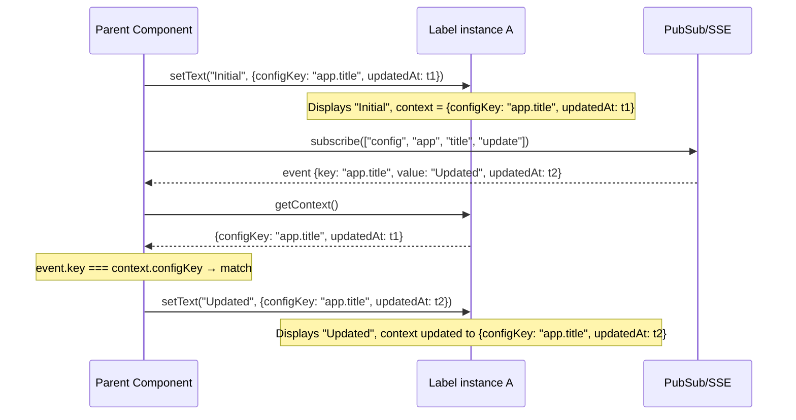

# Label Component

## Overview

The `Label` component is a passive, read-only text display component. Its primary purpose is to display text that can be updated programmatically from outside — typically by a parent component that subscribes to PubSub/SSE events and calls `setText()` on the Label's imperative handle when relevant changes occur.

Unlike `InputField` and `Toggle`, the Label provides no user interaction surface: no `onChange`, no editing affordances, no keyboard activation. It is purely a text rendering primitive with a programmatic update API. This makes it the appropriate replacement for every raw `<span>`, `<div>`, and status pill in the codebase that displays application state and needs to react to server-sent events without entering an edit mode.

The component exposes an **imperative, ref-based API** via `forwardRef` + `useImperativeHandle`. Parent components interact with it through the `LabelHandle` interface for programmatic text updates, visibility control, and PubSub event matching via an opaque `context` record.

## Design Goals

- **Read-only by design.** No `onChange`, no click handlers, no focus management, no input. The Label is the component you use when a value should be seen but not touched. This eliminates an entire class of bugs where raw `<span>` elements accidentally become interactive through parent event delegation.
- **PubSub-reactive through the parent.** The Label itself does not subscribe to PubSub events. Instead, the parent subscribes, uses `getContext()` to match incoming events to the correct Label instance, and calls `setText()` to update the display. This is the same separation-of-concerns pattern used by `Toggle` and `InputField`.
- **Opaque context for event matching.** The `context` field (an opaque `Record<string, unknown>`) is carried alongside the displayed text via `setText(text, context?)`. The parent uses this context to answer "is this PubSub event for *this* Label?" when multiple Labels share a subscription.
- **Consistent text rendering.** All Labels use the same semantic HTML, CSS class structure, and size variants. This replaces the current ad-hoc mix of raw `<span>`, `<div>`, `StatusChip` (`mui-pill`), and inline `{expression}` rendering in JSX.
- **Imperative control without re-render churn.** Parents update Label text through the ref handle rather than through React prop changes. This avoids cascading re-renders when a PubSub event updates dozens of Labels on a single page.
- **Accessibility as a first-class concern.** Labels render as semantic `<output>` elements (or `<span>` where `<output>` is not appropriate), ensuring screen readers announce the displayed text. Size variants are conveyed via CSS, not inline styles.

## Architecture

### Component Tree

```
Label (forwardRef)
├── Wrapper <output> or <span>
│   ├── .label-text       Main display text
│   └── .label-hint       Optional hint/subtitle below the main text
```

The component renders **nothing** when `visible` is `false`.

The Label is a non-generic component — it always deals with `string` text. Unlike `Toggle<T>`, there is no value type parameter because the Label has no concept of a typed value, only a display string.

### Imperative API Pattern

The component uses React's `forwardRef` to expose a `LabelHandle` via `useImperativeHandle`. The handle provides methods for reading and mutating the component's internal state:

```ts
// Parent usage
const labelRef = useRef<LabelHandle>(null);

// On mount, seed the initial text with context
useEffect(() => {
    labelRef.current?.setText(formatValue(initialValue), {
        configKey: `${domain}.${key}`,
        updatedAt: initialUpdatedAt,
    });
}, [initialValue, initialUpdatedAt, domain, key]);

// Later, in a PubSub callback:
labelRef.current?.setText(formatValue(event.newValue), {
    configKey: event.configKey,
    updatedAt: event.updatedAt,
});
```

The component also accepts a callback prop (`onTooltip`) that receives the `LabelHandle` as its argument, allowing the parent to return contextual tooltip text.

### Relationship to Parent Components

A typical parent (e.g., a config list row showing a non-editable value, or a detail page displaying an entity name) holds a `ref` to each `Label` instance. On mount, the parent calls `setText(initialText, context)` to seed the display. The `context` argument carries an opaque record that typically includes an identifier (e.g., `{ configKey: "app.title" }`) and optimistic locking metadata (e.g., `{ updatedAt }`).

When the parent's PubSub subscription fires with an update event, the parent:
1. Reads `labelRef.current.getContext()` to extract the identifier.
2. Compares the event's identifying fields against the context.
3. If the event matches, calls `labelRef.current.setText(newText, { ...context, updatedAt: event.updatedAt })`.

The Label has no concurrency model of its own — it is purely a display surface. Updates are always accepted. There is no dirty-flag mechanism because the Label cannot be in a "user is currently editing" state.

## Props

All props are passed as a single props object to the `forwardRef`-wrapped component.

| Prop | Type | Default | Description |
|------|------|---------|-------------|
| `text` | `string` | `""` | Initial display text. After mount, text is managed internally via `setText()` — this prop is **only** used for the initial render. |
| `visible` | `boolean` | `true` | When `false`, the component renders nothing (`null`). |
| `size` | `"small" \| "normal" \| "large"` | `"normal"` | Controls the font size of the display text. `"small"` is appropriate for table cells and secondary metadata. `"normal"` is the default for most inline displays. `"large"` is intended for page headings, KPI values, and prominent entity names. |
| `onTooltip` | `(component: LabelHandle) => string \| undefined` | `undefined` | Called to retrieve tooltip text for the Label. If the callback returns `undefined` or an empty string, no tooltip is shown. The callback receives the Label's handle, so the tooltip can be dynamic based on current text or context. |

### Props Deliberately Not Exposed

- **`className`**, **`style`**: The `size` prop already controls the visual presentation. All styling is internal to the component and can be customized via the CSS file. Additional class/style props can be added later if a concrete use case arises.
- **`children`**: The Label renders text from its internal state, not from React children. The `text` prop and `setText()` are the single source of truth for displayed content.
- **`onChange`**, **`onClick`**, **`onFocus`**, etc.: The Label is read-only by design. No interaction callbacks are exposed. If a clickable label is needed, wrap the Label in a `<button>` or use a different component.

## Imperative API (`LabelHandle`)

The following methods are exposed on the ref handle returned by `useImperativeHandle`:

| Method | Signature | Description |
|--------|-----------|-------------|
| `setText` | `(text: string, context?: Record<string, unknown>) => void` | Updates the displayed text and stores an optional opaque context record. The context typically carries an identifier (e.g., `{ configKey }`) for PubSub event matching and optimistic locking metadata (e.g., `{ updatedAt }`). Calling this replaces both the text and the context atomically. |
| `getText` | `() => string` | Returns the currently displayed text. |
| `getContext` | `() => Record<string, unknown> \| null` | Returns the opaque context record stored by the last `setText` call, or `null` if none has been set. |
| `setVisible` | `(visible: boolean) => void` | Shows or hides the Label programmatically. When hidden, the component renders `null`. |
| `getVisible` | `() => boolean` | Returns whether the Label is currently visible. |
| `setHintText` | `(text: string) => void` | Sets hint text displayed below the main label text. Pass an empty string or `""` to hide the hint. |
| `getHintText` | `() => string` | Returns the current hint text. |

### Methods Not Included

The Label handle does **not** include `setValue`/`getValue` (generic value methods), `setDirty`/`getDirty`/`revertValue`, `setDisabled`/`getDisabled`, or `setOptions`/`getOptions`. Rationale:

- **No value model**: The Label has no typed value, only a display string. There is no concept of a "confirmed" vs. "draft" value, so there is no revert mechanism.
- **No dirty flag**: The Label cannot be in a provisional editing state. All updates are final from the Label's perspective.
- **No disabled state**: The Label is never interactive, so disabling it is meaningless.
- **No options**: The Label has no selectable options or state cardinality model.

## PubSub Integration Pattern

### Parent-Driven Model

The Label component itself does **not** subscribe to PubSub events. The parent component owns the entire PubSub lifecycle: subscription, event filtering, and text update dispatch. This is the identical architectural pattern used by `Toggle` and `InputField`.

The Label provides two things that make this pattern work:
1. **`context`** — an opaque record set via `setText(text, context?)` and retrieved via `getContext()`. The parent stores enough identifying information in the context to match incoming PubSub events to the correct Label instance.
2. **`setText()`** — the imperative method the parent calls to update the display when a matching PubSub event arrives.

### Sequence Diagram



### Why the Label Does Not Subscribe Internally

1. **Separation of concerns.** The Label is a presentation-level primitive. It does not know about the application's PubSub tag conventions, topic topology, or subscription lifecycle. The parent owns this domain knowledge.
2. **Subscription lifecycle.** The parent controls when subscriptions are created and torn down (via `useEffect` cleanup). If the Label managed its own subscriptions, it would need to know React lifecycle details that belong in the parent.
3. **Batched subscriptions.** A parent that renders 50 Labels (e.g., a config list with 50 entries) may prefer a single PubSub subscription that dispatches to all 50 Labels via context matching, rather than 50 separate subscriptions. The parent-driven model enables this optimization.
4. **Event format knowledge.** PubSub event payloads vary by domain (config events have a different shape than user events or API key events). The Label has no knowledge of these shapes — the parent translates the event payload into a display string before calling `setText()`.

### Context as the Matching Key

The `context` record serves as the bridge between an opaque PubSub event and a specific Label instance. The parent decides what identifying fields to store in the context. Common patterns:

| Use Case | Context Fields | PubSub Match Logic |
|----------|---------------|-------------------|
| Config value display | `{ configKey: "app.title", updatedAt }` | `event.key === ctx.configKey` |
| Entity name display | `{ entityType: "user", identifier: "abc-123" }` | `event.entityType === ctx.entityType && event.identifier === ctx.identifier` |
| Status label | `{ resourceType: "apiKey", resourceId: "key-1" }` | `event.resourceType === ctx.resourceType && event.resourceId === ctx.resourceId` |
| Aggregate/metric display | `{ metricKey: "activeUsers" }` | `event.metricKey === ctx.metricKey` |

## Hint Text

- Rendered as a plain inline element (e.g., `<small>` or `<div>`) below the label text.
- Set imperatively via `setHintText(text: string)`.
- Hidden entirely when the text is an empty string (`""`).
- Single neutral style — no severity levels (no error/warning/success variants). The parent can include semantic styling in the text itself (e.g., via inline classes) if needed.
- Positioned directly below the `.label-text` element within the `.label-container`.
- The hint text is independent of the main text — calling `setText()` does not clear the hint text. The parent must call `setHintText("")` explicitly if the hint should be cleared.

### When to Use Hint Text

- Displaying the last-updated timestamp: `setHintText("Updated: " + new Date(event.updatedAt).toLocaleString())`
- Showing a staleness warning: `setHintText("This value may be outdated. Refresh the page.")`
- Indicating the source of a derived value: `setHintText("Computed from 3 configuration entries")`

## Usage Examples

### Basic Static Label

The simplest usage: a Label initialized with text that never changes. This is the direct replacement for `<span>{value}</span>`.

```tsx
import { useRef, useEffect } from "react";
import Label, { type LabelHandle } from "@/ui/components/Label";

function UserGreeting({ userName }: { userName: string }) {
    const labelRef = useRef<LabelHandle>(null);

    useEffect(() => {
        labelRef.current?.setText(`Welcome, ${userName}`);
    }, [userName]);

    return <Label ref={labelRef} />;
}
```

### PubSub-Reactive Config Value Display

The canonical use case: a read-only config value that updates live when another user changes it. This replaces the current passive PubSub subscription in `AdminConfigList` (lines 462–481) that re-renders the entire group list on every config update.

```tsx
import { useRef, useEffect } from "react";
import Label, { type LabelHandle } from "@/ui/components/Label";
import { subscribe, unsubscribe } from "@/ui/pubsub";
import { TAG_CONFIG, TAG_UPDATE } from "@/types/PubSubType";
import type { PubSubMessage } from "@/types/PubSubType";

function ConfigValueLabel({ domain, key, initialValue, initialUpdatedAt }: {
    domain: string;
    key: string;
    initialValue: string;
    initialUpdatedAt: string;
}) {
    const labelRef = useRef<LabelHandle>(null);

    useEffect(() => {
        labelRef.current?.setText(initialValue, {
            configKey: `${domain}.${key}`,
            updatedAt: initialUpdatedAt,
        });
    }, [initialValue, initialUpdatedAt, domain, key]);

    useEffect(() => {
        const token = subscribe(
            { and: [TAG_CONFIG, domain, key, TAG_UPDATE] },
            (msg: PubSubMessage) => {
                const ctx = labelRef.current?.getContext();
                if (!ctx || ctx.configKey !== `${domain}.${key}`) return;

                const newValue = String(msg.data?.value ?? "");
                labelRef.current?.setText(newValue, {
                    configKey: ctx.configKey,
                    updatedAt: msg.data?.updatedAt,
                });
            }
        );
        return () => { if (token) unsubscribe(token); };
    }, [domain, key]);

    return <Label ref={labelRef} />;
}
```

### Label with Context for Precise PubSub Matching

Demonstrates a parent that manages a single PubSub subscription dispatching to multiple Labels via context matching.

```tsx
function ConfigValueTable({ entries }: { entries: ConfigEntryUI[] }) {
    const labelRefs = useRef<Map<string, LabelHandle>>(new Map());

    const setLabelRef = (configKey: string) => (ref: LabelHandle | null) => {
        if (ref) {
            labelRefs.current.set(configKey, ref);
        } else {
            labelRefs.current.delete(configKey);
        }
    };

    // Single subscription for all config updates
    useEffect(() => {
        const token = subscribe(
            { and: [TAG_CONFIG] },
            (msg: PubSubMessage) => {
                const { domain, key, value } = msg.data ?? {};
                if (!domain || !key || value === undefined) return;

                const configKey = `${domain}.${key}`;
                const labelRef = labelRefs.current.get(configKey);
                if (!labelRef) return;

                labelRef.setText(String(value), {
                    configKey,
                    updatedAt: msg.data?.updatedAt,
                });
            }
        );
        return () => { if (token) unsubscribe(token); };
    }, []);

    return (
        <table>
            <tbody>
                {entries.map((entry) => {
                    const configKey = `${entry.domain}.${entry.key}`;
                    return (
                        <tr key={configKey}>
                            <td><code>{entry.key}</code></td>
                            <td>
                                <Label
                                    ref={setLabelRef(configKey)}
                                    text={String(entry.value ?? "")}
                                    size="small"
                                />
                            </td>
                        </tr>
                    );
                })}
            </tbody>
        </table>
    );
}
```

### Tooltip Example

A Label with a dynamic tooltip that shows last-updated information from the context.

```tsx
import { useRef, useEffect } from "react";
import Label, { type LabelHandle } from "@/ui/components/Label";

function TooltippedLabel({ initialValue, initialUpdatedAt }: {
    initialValue: string;
    initialUpdatedAt: string;
}) {
    const labelRef = useRef<LabelHandle>(null);

    useEffect(() => {
        labelRef.current?.setText(initialValue, { updatedAt: initialUpdatedAt });
    }, [initialValue, initialUpdatedAt]);

    return (
        <Label
            ref={labelRef}
            onTooltip={(component) => {
                const ctx = component.getContext();
                if (ctx?.updatedAt) {
                    return `Last updated: ${new Date(ctx.updatedAt as string).toLocaleString()}`;
                }
                return undefined;
            }}
        />
    );
}
```

### Hidden/Visible Toggle

A Label that can be programmatically shown and hidden.

```tsx
function ConditionalLabel({ text, show }: { text: string; show: boolean }) {
    const labelRef = useRef<LabelHandle>(null);

    useEffect(() => {
        labelRef.current?.setText(text);
    }, [text]);

    useEffect(() => {
        labelRef.current?.setVisible(show);
    }, [show]);

    return <Label ref={labelRef} />;
}
```

### Size Variants

```tsx
// Small: for table cells, secondary metadata
<Label ref={smallRef} text="42" size="small" />

// Normal: default for most inline text
<Label ref={normalRef} text="Application Title" size="normal" />

// Large: for page headings, KPI values, prominent entity names
<Label ref={largeRef} text="$24,500" size="large" />
```

## Accessibility

### Semantic HTML

The Label renders as an `<output>` element when displaying a computed or programmatically-updated value. This is the semantically correct element for "the result of a calculation or user action" per the HTML specification. When used purely as static text (no programmatic updates expected), it falls back to a `<span>`.

| Usage | Element | Rationale |
|-------|---------|-----------|
| Config value that updates via PubSub | `<output>` | Represents a programmatically updated result |
| Entity name in detail view (SSE-updated) | `<output>` | May update when another user renames the entity |
| Static label text (no updates) | `<span>` | Simple inline text with no dynamic behavior |
| Status pill text | `<output>` | Status may change via PubSub events |

### ARIA Properties

- The `<output>` element has an implicit `aria-live="polite"` role in most screen readers, meaning changes to the text content are announced without stealing focus.
- When the Label wraps a metric or KPI value, an `aria-label` attribute can provide a human-readable description: `<output aria-label="Active users: 1,234">1,234</output>`.
- The hint text element receives `aria-describedby` association with the main text element when hint text is present, ensuring screen readers announce the hint after the value.

### Screen Reader Behavior

- **Text updates**: When `setText()` changes the displayed text, screen readers announce the new value. The `<output>` element's live region behavior ensures this happens automatically.
- **Visibility changes**: When `setVisible(false)` is called, the element is removed from the DOM (`null`), removing it from the accessibility tree. When `setVisible(true)` is called, the element is reinserted and announced.
- **No focus management**: The Label does not receive focus. It is never in the tab order. Screen readers encounter it in reading order as they traverse the page.

## Styling

The component uses a dedicated CSS file at `static/public/Label.css`. The Label does not depend on PrimeReact for its rendering — it uses native HTML elements styled with CSS classes.

### CSS Architecture

```
Label.css
├── .label-container              Wrapper for the label
├── .label-text                   The main display text
├── .label-hint                   Hint text below the main text
├── .label-container.small        Size variant: small (e.g., 0.8rem)
├── .label-container.normal       Size variant: normal (e.g., 1rem, default)
├── .label-container.large        Size variant: large (e.g., 1.25rem)
├── .label-container.hidden       Visual treatment when visibility is toggled off
└── .label-container.has-tooltip  Cursor indicator when a tooltip is available
```

### Size Variant Mapping

| Size | Font Size | Line Height | Use Case |
|------|-----------|-------------|----------|
| `"small"` | `0.8rem` | `1.2` | Table cells, secondary metadata, timestamps, array summaries |
| `"normal"` | `1rem` | `1.5` | Default inline text, config values, entity property displays |
| `"large"` | `1.25rem` | `1.4` | Page headings, KPI values, prominent entity names, dashboard metrics |

### Integration with Existing Styles

The Label's CSS is self-contained and does not override or depend on existing `styles.css` or `theme.css` classes. The `.label-container` uses the project's CSS custom properties (design tokens) for colors, ensuring consistency with the PrimeReact theme.

If existing classes like `.admin-detail-grid` or `.admin-table` wrap a Label, the Label inherits font-family and base styles from those parent contexts naturally through CSS inheritance.

## Replacement Mapping

This section maps every existing raw text display pattern in the codebase to the `Label` component replacement.

### Config Value Displays (Non-Editing Rows)

**Current location:** [`AdminConfigList.tsx`](../../src/ui/pages/AdminConfigList.tsx), lines 798–806
**Current pattern:** `{formatScalarValue(entry)}` rendered inside a `<button className="admin-config-value-button">` in non-editing table rows. The entire groups array is re-rendered on every PubSub config update (lines 462–481).
**Replacement:** For config values that should display live updates without entering edit mode, use `<Label ref={ref} size="small" />` with a parent-driven PubSub subscription that calls `setText()` on the matching Label. This eliminates the full table re-render on every config change.
**Context:** `{ configKey: "${domain}.${key}", updatedAt }` set via `setText()`

### StatusChip (mui-pill) Replacements

**Current locations:**
- [`AdminUserList.tsx`](../../src/ui/pages/AdminUserList.tsx), line 26: `<span className="mui-pill">{disabled ? "Disabled" : "Enabled"}</span>`
- [`AdminGroupList.tsx`](../../src/ui/pages/AdminGroupList.tsx), line 26: `<span className="mui-pill">{disabled ? "Disabled" : "Enabled"}</span>`
- [`AdminUserDetail.tsx`](../../src/ui/pages/AdminUserDetail.tsx), line 28: `<span className="mui-pill">{disabled ? "Disabled" : "Enabled"}</span>`
- [`AdminGroupDetail.tsx`](../../src/ui/pages/AdminGroupDetail.tsx), line 35: `<span className="mui-pill">{disabled ? "Disabled" : "Enabled"}</span>`

**Current pattern:** `StatusChip` helper function returning a `<span>` with conditional `mui-pill` class and ternary text.
**Replacement:** `<Label ref={ref} text={disabled ? "Disabled" : "Enabled"} size="small" />` with context `{ entityType, identifier, disabled }`. When a PubSub event updates the entity's disabled status, the parent calls `setText()` with the new text.
**Context:** `{ entityType: "user" | "group", identifier, disabled }` set via `setText()`

### Entity Property Displays in Detail Pages

**Current locations:**
- [`AdminUserDetail.tsx`](../../src/ui/pages/AdminUserDetail.tsx), lines 66–72: `<div><strong>First name:</strong> {user.firstName}</div>` and similar for lastName, email, identifier, createdAt, updatedAt
- [`AdminGroupDetail.tsx`](../../src/ui/pages/AdminGroupDetail.tsx), lines 119–123: `<div><strong>Name:</strong> {groupPayload.group.groupName}</div>` and similar
- [`AdminFunctionalPermissionDetail.tsx`](../../src/ui/pages/AdminFunctionalPermissionDetail.tsx), lines 116–121: `<div><strong>Name:</strong> {detailPayload.functionalPermission.functionalPermissionName}</div>` and similar

**Current pattern:** Raw JSX expressions `{entity.field}` inside `<div>` elements in `.admin-detail-grid`.
**Replacement:** `<Label ref={ref} text={entity.field} size="normal" />` with context `{ entityType, identifier, fieldName }`. When a PubSub event updates the entity, the parent calls `setText()` on the relevant Label without re-rendering the entire detail grid.
**Context:** `{ entityType, identifier, fieldName }` set via `setText()`

### Table Cell Text Displays

**Current locations:**
- [`AdminUserDetail.tsx`](../../src/ui/pages/AdminUserDetail.tsx), lines 101–105: `<td>{permission.functionalPermissionName}</td>`, `<td>{permission.description}</td>`
- [`AdminFunctionalPermissionDetail.tsx`](../../src/ui/pages/AdminFunctionalPermissionDetail.tsx), line 183: `<td>{group.disabled ? "Disabled" : "Enabled"}</td>`
- [`AdminGroupDetail.tsx`](../../src/ui/pages/AdminGroupDetail.tsx), lines 146–166: permission assignment table cells

**Current pattern:** Raw JSX expressions `{value}` inside `<td>` elements.
**Replacement:** `<Label ref={ref} text={String(value)} size="small" />` for cells that need live updates. For truly static table content, the raw expression is still acceptable — the Label is for values that change at runtime.
**Context:** `{ entityType, identifier, column }` set via `setText()`

### Pager and Summary Text

**Current locations:**
- [`AdminAuditLog.tsx`](../../src/ui/pages/AdminAuditLog.tsx), lines 232–234: `<span>Page {page + 1} of {totalPages}</span>`, `<span>{total} entries</span>`
- [`AdminGroupDetail.tsx`](../../src/ui/pages/AdminGroupDetail.tsx), line 204: `<span>{permissionsTotal} functional permissions</span>`

**Current pattern:** Raw `<span>` elements with template literals.
**Replacement:** `<Label ref={ref} text={`Page ${page + 1} of ${totalPages}`} size="small" />` — useful when the pager text should update without a full parent re-render. For simple cases where the parent already re-renders, raw `<span>` is still acceptable.

### Dashboard Metric Displays

**Current location:** [`Dashboard.tsx`](../../src/ui/pages/Dashboard.tsx), lines 20–24
**Current pattern:** `<p className="mui-kpi-value">$24k</p>` with static text.
**Replacement:** `<Label ref={ref} text="$24k" size="large" />` with a parent-driven PubSub subscription for live metric updates.
**Context:** `{ metricKey: "budget" }` set via `setText()`

## Files

| Path | Role |
|------|------|
| [`src/ui/components/Label.tsx`](../../src/ui/components/Label.tsx) | Main component implementation (`forwardRef` + `useImperativeHandle`) |
| [`static/public/Label.css`](../../static/public/Label.css) | Component styles (served as static asset, loaded via `<link>` in `index.html`) |
| [`src/ui/pubsub.ts`](../../src/ui/pubsub.ts) | Browser-side PubSub (used by parent components for event-driven text updates) |
| [`src/ui/server_sent_events.ts`](../../src/ui/server_sent_events.ts) | Browser EventSource bridge (delivers PubSub events from server) |
| [`design/pubsub.md`](../pubsub.md) | Tag-based PubSub specification |
| [`design/server-sent-events.md`](../server-sent-events.md) | SSE architecture |
| `design/ui/Label.md` | This document |

## Design Decisions

1. **Read-only by design — no `onChange`.** The Label is a display primitive, not an input. Adding an `onChange` would blur the distinction between Label and InputField, leading to confusion about which component to use. Labels that need click behavior should be wrapped in a `<button>` by the parent. This maintains a clear separation: InputField for editable values, Toggle for togglable values, Label for read-only values.

2. **No generic value type — always `string`.** Unlike `Toggle<T>` which must handle `boolean`, `boolean | null`, string enums, and arbitrary types, the Label only displays text. The parent is responsible for formatting any typed value into a display string before calling `setText()`. This keeps the Label API simple and avoids the complexity of format functions, type coercion, and value comparison logic inside the component.

3. **Parent-driven PubSub, not internal subscription.** The Label is a presentation primitive. It does not know about PubSub tag conventions, topic topologies, or the shape of event payloads. The parent owns the subscription lifecycle and translates domain events into simple `setText()` calls. This is the same pattern used by `Toggle` and `InputField` — consistency across all three primitives makes the codebase predictable.

4. **Context for event matching, not for the Label's own logic.** The `context` record is stored by the Label but never inspected by it. It exists solely for the parent to retrieve via `getContext()` and use for event matching. The Label does not care what fields are in the context — it is an opaque pass-through. This is identical to how `Toggle` and `InputField` use context.

5. **`setText` replaces both text and context atomically.** Calling `setText("new text", newContext)` replaces both the displayed text and the stored context in a single operation. This prevents a race condition where text is updated but context still refers to the old value, which could cause PubSub events to be matched incorrectly during the gap.

6. **Three size variants, not arbitrary CSS.** Limiting sizes to `"small"`, `"normal"`, and `"large"` ensures visual consistency across the application. These three sizes cover all current and anticipated use cases (table cells, inline text, headings/metrics). If a fourth size is needed in the future, it can be added to the union type and CSS without breaking existing usages.

7. **`<output>` over `<span>` for dynamic text.** The `<output>` element is the semantically correct HTML element for a value that is programmatically updated. It provides built-in `aria-live` behavior in most screen readers without requiring explicit ARIA attributes. For truly static text that never updates, `<span>` is used as a fallback.

8. **No formatter support.** Formatting (date formatting, number formatting, currency, etc.) is the parent's responsibility. The Label receives a plain string and displays it. This keeps the component simple and avoids pulling formatting dependencies into a low-level display primitive. Parents can use `Intl.DateTimeFormat`, `Intl.NumberFormat`, or project-specific formatters before calling `setText()`.

9. **No concurrency model.** The Label has no dirty flag, no revert mechanism, and no conflict detection. Since the user cannot interact with a Label, there is no "user's in-progress edit" to protect. The Label always displays the most recent text it received via `setText()`. This is the correct behavior for a read-only display.

10. **No `disabled` prop.** A disabled state implies the possibility of an enabled (interactive) state. Since the Label is never interactive, there is no disabled state to model. To visually de-emphasize a Label, the parent can set the text to a muted representation or wrap the Label in a container with reduced opacity.

11. **Hint text is independent of main text.** Unlike `Toggle` where `revertValue()` clears the hint text, the Label has no revert operation, so hint text must be managed explicitly by the parent. This gives the parent full control over when hints appear and disappear.

## Future Considerations

- **Rich text support.** A future `richText` prop or `setRichText()` method could accept a subset of HTML (bold, italic, links) for Labels that need formatting beyond plain text. This would require careful sanitization (e.g., via DOMPurify) to prevent XSS.
- **Copy-to-clipboard affordance.** An optional `copyable` prop could render a small copy icon next to the text. Clicking the icon copies the text to the clipboard. This would be useful for technical identifiers, API keys, and configuration values.
- **Truncation with ellipsis.** A `truncate` prop could enable CSS text-overflow ellipsis for Labels in constrained-width containers (e.g., table cells with long values). This would be a CSS-only feature — no JavaScript truncation logic.
- **Loading skeleton state.** A `loading` prop could render a shimmer/skeleton placeholder instead of the text, for Labels that display data being fetched asynchronously. This would provide visual feedback during initial page loads or PubSub reconnection.
- **Monospace variant.** A `monospace` boolean prop could switch the font-family to a monospace stack for displaying code-like values (UUIDs, configuration keys, technical identifiers) without requiring the parent to wrap in a `<code>` element.
- **Text transformation.** An optional `transform` prop (`"uppercase"`, `"lowercase"`, `"capitalize"`) could apply CSS `text-transform` for consistent formatting of status labels and category names.
- **Inline icon prefix.** An optional `icon` prop could render a small PrimeReact icon before the text, for Labels that benefit from a visual indicator (e.g., a warning icon next to a "Disabled" status).
- **Color variant for status labels.** A `tone` prop (`"neutral"`, `"positive"`, `"warning"`, `"negative"`) could apply semantic color coding to the Label, replacing the current `mui-pill` class pattern for status displays.
