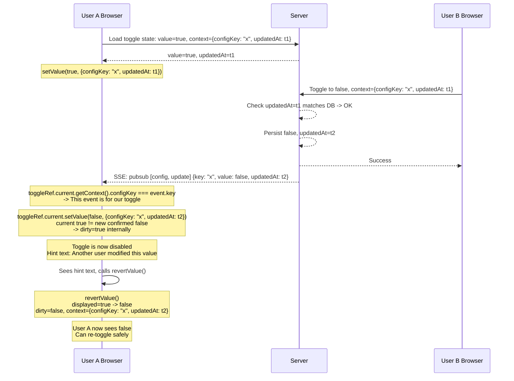

# Toggle Component

## Overview

The `Toggle` component is a reusable, generic controlled input for immediate state toggling within the admin UI. It provides three visual presentation variants — a sliding switch, a checkbox, and a pill/chip — all sharing a single imperative API and consistent behavioral contract.

The component supports a **generic value model**: the value type `T` can be `boolean`, a string enum, a numeric constant, or any arbitrary type. The number of states (bi-state, tri-state, or multi-state) is driven entirely by the `options` array — not by a separate `triState` prop or by the visual variant. The variant determines only how the control looks and which PrimeReact component backs it; the options array determines what values are available and how many states exist.

Toggle changes are semantically immediate — flipping a switch, checking a box, or cycling a pill is the action itself, not a provisional edit that needs confirmation. The component's `onChange` callback fires synchronously with the user's click/tap, and the parent is responsible for persisting the new value.

The component exposes an **imperative, ref-based API** via `forwardRef` + `useImperativeHandle`. Parent components interact with it through the `ToggleHandle<T>` interface for programmatic reads, state overrides, and concurrent-modification signaling.

## Design Goals

- **Options-driven state model.** The `options` prop is the single source of truth for all labeling and state cardinality. No separate `label`, `onLabel`, `offLabel`, or `triState` props exist. The count of options determines whether the control is bi-state (2 options), tri-state (3 options), or multi-state (4+ options). A single-option convenience mode auto-appends a logical negation.
- **Generic value model.** One component handles `boolean`, `boolean | null` (tri-state), and arbitrary multi-state values through a single generic API surface. The `value` type is driven by the options array's value type.
- **Single component, three visual variants.** One API surface for toggle switch, checkbox, and pill/chip layouts. The `variant` prop selects the presentation; the imperative API contract is consistent across all three.
- **Immediate mutation.** No save/undo buttons. The `onChange` callback fires on each interaction and the parent persists the change directly. This matches the existing boolean editing pattern used in [`AdminConfigList`](../../src/ui/pages/AdminConfigList.tsx) (lines 714–737).
- **Imperative control.** Parents read and override the toggle state through a typed ref handle. This enables PubSub/SSE-driven dirty-flag signaling without parent re-render churn.
- **Concurrency safety.** A dirty-flag mechanism (driven externally via the imperative API) signals that the underlying data has been modified by another user or process. The parent can disable the toggle and show a hint to prevent lost updates.
- **Opaque context for callback identification.** The `context` field (an opaque `Record<string, unknown>`) is set by the parent alongside the confirmed value and round-tripped through `onChange` callbacks and PubSub event matching. This lets the parent identify which specific toggle instance triggered an event when multiple toggles share a handler.
- **Accessibility first.** All variants use appropriate ARIA roles (`switch`, `checkbox`, or `button` with `aria-pressed`). Labels are programmatically associated. Tri-state checkbox renders with `aria-checked="mixed"` when the current option index corresponds to the third option (options[2]).
- **Replaces all existing patterns.** The component is designed to supersede every current usage of `InputSwitch`, raw `<input type="checkbox">`, `ToggleButton`, and toggle-style `Chip` throughout the admin UI.

## Architecture

### Component Tree

```
Toggle<T> (forwardRef)
├── variant="toggle"   ─── PrimeReact InputSwitch
│                           └── Native <div> with role="switch"
├── variant="checkbox" ─── PrimeReact Checkbox (options.length === 2)
│                           │
│                           PrimeReact TriStateCheckbox (options.length === 3)
│                           │
│                           └── Native <input> with role="checkbox"
├── variant="pill"     ─── Custom <button> with role="button" and aria-pressed
│                           └── Label text inside the pill, changes per active option
└── Hint Text (plain inline element below the control, set imperatively)
```

The component renders **nothing** when `visible` is `false`.

### Backing Elements by Variant and Option Count

| Variant | Options Count | Backing Element | Visual |
|---------|---------------|-----------------|--------|
| `"toggle"` | 2 | PrimeReact `InputSwitch` | Sliding pill switch |
| `"checkbox"` | 2 | PrimeReact `Checkbox` | Standard checked/unchecked checkbox |
| `"checkbox"` | 3 | PrimeReact `TriStateCheckbox` | Checked / unchecked / indeterminate |
| `"pill"` | 2 | Custom `<button>` with `aria-pressed` | Clickable pill, toggles between two labels |
| `"pill"` | 3 | Custom `<button>` with `aria-pressed` | Clickable pill, cycles through three labels |
| `"pill"` | 4+ | Custom `<button>` with `aria-pressed` | Clickable pill, cycles through all labels |

### Option-Count-Driven State Cardinality

The component does **not** have a `triState` prop. The number of options in the `options` array determines whether the control operates in bi-state, tri-state, or multi-state mode:

```
options.length === 1  →  Auto-append a negation option → bi-state (2 options)
options.length === 2  →  Bi-state
options.length === 3  →  Tri-state
options.length >= 4   →  Multi-state
```

If `options.length` exceeds the maximum supported by a variant, the component truncates silently (see [Options & State Model](#options--state-model)).

### Imperative API Pattern

The component uses React's `forwardRef` to expose a `ToggleHandle<T>` via `useImperativeHandle`. The handle provides methods for reading and mutating the component's internal state:

```ts
// Parent usage
const toggleRef = useRef<ToggleHandle<boolean>>(null);

// Later, in an SSE callback:
toggleRef.current?.setDirty(true);
toggleRef.current?.setHintText("Another user modified this value.");
toggleRef.current?.setDisabled(true);
```

The component also accepts callback props (`onChange`, `onDirty`) that receive the `ToggleHandle<T>` as their argument, allowing the parent to query the toggle state when an event fires.

### Relationship to Parent Components

A typical parent (e.g., a config list row or a permission assignment table) holds a `ref` to each `Toggle<T>` instance. On mount, the parent calls `setValue(initialValue, context)` to seed the confirmed state. The `context` argument carries an opaque record that typically includes both an identifier (e.g., `{ configKey: "some.feature" }`) and optimistic locking metadata (e.g., `{ updatedAt }`). When the user toggles, the `onChange` callback fires with `(component)`. The parent calls `component.getValue()` to retrieve the new value and `component.getContext()` to identify which toggle changed, then immediately persists.

On success, the parent calls `component.setValue(newValue, { ...context, updatedAt: newUpdatedAt })` to confirm. If the API returns `409 Conflict` (optimistic lock failure), the parent calls `component.setDirty(true)`, `component.setHintText(...)`, and `component.revertValue()`.

## Props

All props are passed as a single props object to the `forwardRef`-wrapped component.

| Prop | Type | Default | Description |
|------|------|---------|-------------|
| `variant` | `"toggle" \| "checkbox" \| "pill"` | `"toggle"` | Selects the visual presentation variant. Does **not** constrain the value type or state count — that is determined by `options`. |
| `value` | `T` | First option's value | Initial value. After mount, state is managed internally via `setValue()` — this prop is **only** used for the initial value. Must match one of the values in `options`. |
| `options` | `{ value: T; label: string }[]` | **Required** | The single source of truth for all labeling and state cardinality. Each entry defines a possible value and its display label. The number of options drives bi-state (2), tri-state (3), or multi-state (4+) behavior. When only 1 option is provided, a second "NOT" option is auto-appended at runtime. |
| `disabled` | `boolean` | `false` | When `true`, the toggle is non-interactive (grayed out). |
| `visible` | `boolean` | `true` | When `false`, the component renders nothing (`null`). |
| `size` | `"small" \| "normal"` | `"normal"` | Controls the physical size of the control. For `variant="toggle"`, maps to the PrimeReact `InputSwitch` size. For `variant="pill"`, controls font-size and padding. |
| `onChange` | `(component: ToggleHandle<T>) => void` | `undefined` | Called when the user toggles the control. The parent is responsible for persisting the new value. Retrieve the new value via `component.getValue()` and the identity context via `component.getContext()`. |
| `onDirty` | `(component: ToggleHandle<T>) => void` | `undefined` | Called whenever the component's internal dirty status changes. Useful for parent components to update hint text or UI state in response to dirty-state transitions. |
| `onTooltip` | `(component: ToggleHandle<T>) => string \| undefined` | `undefined` | Called to retrieve tooltip text for the toggle. If the callback returns `undefined` or an empty string, no tooltip is shown. |

### Props Deliberately Removed

The following props from the previous Toggle design are **not** present in this revision. Rationale for each removal:

- **`label`**: Removed. All labeling is now driven by `options`. The active option's `label` field is displayed by the component.
- **`labelPosition`**: Removed. The label is always rendered in a position appropriate to the variant: inline with the switch for `"toggle"`, adjacent to the checkbox for `"checkbox"`, inside the pill for `"pill"`.
- **`onLabel` / `offLabel`**: Removed. All labeling is driven by `options`. For a bi-state toggle, provide `options: [{ value: true, label: "Enabled" }, { value: false, label: "Disabled" }]`.
- **`triState`**: Removed. Tri-state behavior is driven by providing exactly 3 options (e.g., `options: [{ value: true, label: "Granted" }, { value: false, label: "Denied" }, { value: null, label: "Inherit" }]`).

### Props Not Exposed

The component deliberately does **not** expose `className`, `style`, `name`, or `checked` (as a controlled prop). Rationale:

- **`className`**, **`style`**: The variant prop already controls the visual presentation. All styling is internal to the component and can be customized via the CSS file. Additional class/style props can be added later if needed.
- **`name`**: Not needed for the controlled component pattern. Parents distinguish toggle instances via the `context` field — the opaque record set through `setValue(value, context)` and retrieved via `getContext()`.
- **`checked`**: Replaced by the generic `value` prop. The `value` type adapts to whatever type is defined by the `options` array.

## Imperative API (`ToggleHandle<T>`)

The following methods are exposed on the ref handle returned by `useImperativeHandle`:

| Method | Signature | Description |
|--------|-----------|-------------|
| `setValue` | `(value: T, context?: Record<string, unknown>) => void` | Sets the confirmed value and an optional opaque context record. The context typically carries both a toggle identifier (e.g., `{ configKey }`) and optimistic locking metadata (e.g., `{ updatedAt }`). If the current displayed value differs from the new confirmed value, sets `dirty = true` internally. |
| `getValue` | `() => T` | Returns the currently displayed value. |
| `getContext` | `() => Record<string, unknown> \| null` | Returns the opaque context record stored by the last `setValue` call, or `null` if none has been set. |
| `revertValue` | `() => void` | Reverts the displayed value to the last confirmed value (set via `setValue`), clears the dirty flag, clears the hint text, and re-enables the toggle. |
| `setDisabled` | `(disabled: boolean) => void` | Enables or disables the toggle programmatically. |
| `getDisabled` | `() => boolean` | Returns whether the toggle is currently disabled. |
| `getDirty` | `() => boolean` | Returns the current dirty (concurrent-modification) status. |
| `setDirty` | `(status: boolean) => void` | Sets the dirty status. Used by the parent to signal an external concurrent modification (e.g., via SSE/PubSub). |
| `setHintText` | `(text: string) => void` | Sets hint text displayed below the toggle control. Pass an empty string or `""` to hide the hint. |
| `setOptions` | `(options: { value: T; label: string }[]) => void` | Replaces the options array at runtime. The component re-evaluates truncation rules and auto-append logic. If the current displayed value is not in the new options set, the value resets to the first option's value. |
| `getOptions` | `() => { value: T; label: string }[]` | Returns the effective options array after auto-append and truncation have been applied. |

### Method Removed

- **`setLabel`**: Removed. Label is now derived from the active option in the `options` array. To change the label, call `setOptions(...)` with a new options array.

## Options & State Model

The `options` prop is the single source of truth for all labeling and state cardinality. This section defines how `options` drives the component's behavior.

### Options Array Structure

```ts
type ToggleOption<T> = { value: T; label: string };

// Example: bi-state boolean
const BOOL_OPTIONS: ToggleOption<boolean>[] = [
    { value: true,  label: "Enabled" },
    { value: false, label: "Disabled" },
];

// Example: tri-state permission
const PERM_OPTIONS: ToggleOption<boolean | null>[] = [
    { value: true,  label: "Granted" },
    { value: false, label: "Denied" },
    { value: null,  label: "Inherit" },
];

// Example: multi-state status filter
type StatusFilter = "all" | "enabled" | "disabled" | "suspended";
const STATUS_OPTIONS: ToggleOption<StatusFilter>[] = [
    { value: "all",       label: "All" },
    { value: "enabled",   label: "Enabled" },
    { value: "disabled",  label: "Disabled" },
    { value: "suspended", label: "Suspended" },
];
```

### Auto-Append for Single-Option Shortcut

When exactly **1 option** is provided, the component auto-appends a second "NOT" option so the control always has at least 2 states. This is a developer convenience for common boolean cases.

The appended option is computed as follows:

- **Boolean `true`**: The appended option is `{ value: false, label: "Not " + originalLabel }`. Example: `[{ value: true, label: "Enabled" }]` → `[{ value: true, label: "Enabled" }, { value: false, label: "Not Enabled" }]`.
- **Boolean `false`**: The appended option is `{ value: true, label: "Not " + originalLabel }`. Example: `[{ value: false, label: "Hidden" }]` → `[{ value: false, label: "Hidden" }, { value: true, label: "Not Hidden" }]`.
- **Non-boolean `T`**: The appended option has `value: null` (or the type's zero/empty value if `null` is not assignable to `T`) and `label: "Not " + originalLabel`.

| Original Options | Effective Options After Auto-Append |
|------------------|-------------------------------------|
| `[{ value: true, label: "Enabled" }]` | `[{ value: true, label: "Enabled" }, { value: false, label: "Not Enabled" }]` |
| `[{ value: false, label: "Hidden" }]` | `[{ value: false, label: "Hidden" }, { value: true, label: "Not Hidden" }]` |
| `[{ value: "active", label: "Active" }]` | `[{ value: "active", label: "Active" }, { value: null, label: "Not Active" }]` |

The auto-append is applied **before** truncation, so the effective options are always at least 2.

### Truncation Rules Per Variant

Each variant has a maximum number of options it can represent. If `options` (after auto-append) exceeds this maximum, the component silently truncates to the first N options:

| Variant | Max Options | Behavior When Exceeded |
|---------|-------------|------------------------|
| `"toggle"` | 2 | Uses only `options[0]` and `options[1]`. `options[2+]` are silently discarded. |
| `"checkbox"` | 3 | Uses only `options[0]`, `options[1]`, and `options[2]`. `options[3+]` are silently discarded. |
| `"pill"` | Unlimited | Uses all options. No truncation. |

Truncation is **not** an error condition. The component does not warn or throw. The parent is responsible for ensuring the provided options match the intended variant.

### State Cardinality Summary

```
                    ┌──────────────────────────────────────────┐
                    │        options.length (after auto-append) │
                    └──────────────────┬───────────────────────┘
                                       │
              ┌────────────────────────┼──────────────────────────┐
              │                        │                          │
           length = 2              length = 3               length >= 4
              │                        │                          │
              ▼                        ▼                          ▼
        Bi-state mode            Tri-state mode           Multi-state mode
              │                        │                          │
     ┌────────┼────────┐      ┌────────┼────────┐       ┌────────┼────────┐
     │        │        │      │        │        │       │        │        │
  toggle  checkbox  pill   checkbox   pill       (none)  (none)   pill
```

- **Bi-state (2 options)**: All three variants support bi-state. Toggle switch and checkbox use their standard on/off or checked/unchecked appearance. Pill toggles between two labels.
- **Tri-state (3 options)**: Only checkbox and pill support tri-state. Toggle switch is capped at 2 (truncation). Checkbox uses `TriStateCheckbox` for the indeterminate third state. Pill cycles through three labels.
- **Multi-state (4+ options)**: Only pill supports multi-state. Toggle switch caps at 2, checkbox caps at 3 (both via truncation). Pill cycles through all options in index order, wrapping from the last option back to the first.

### Cycling Behavior

On each click/tap of an interactive control:

1. The component advances from the current option to the next option in the (effective, post-truncation) options array.
2. When the last option is reached, the next click wraps around to the first option.
3. For `variant="toggle"` (always exactly 2 options): clicking flips between `options[0]` and `options[1]`.
4. For `variant="checkbox"` with 2 options: clicking toggles between `options[0]` and `options[1]`.
5. For `variant="checkbox"` with 3 options: clicking cycles `options[0]` → `options[1]` → `options[2]` → `options[0]`.
6. For `variant="pill"` with N options: clicking cycles `options[0]` → `options[1]` → ... → `options[N-1]` → `options[0]`.

### Display Label

The component always displays the `label` field of the currently active option. There is no separate `label` or `onLabel`/`offLabel` prop. For `variant="toggle"`, the label of the active option is rendered adjacent to the sliding switch. For `variant="checkbox"`, the label of the active option is rendered adjacent to the checkbox. For `variant="pill"`, the label of the active option is rendered inside the pill button.

## Hint Text

- Rendered as a plain inline element (e.g., `<small>` or `<div>`) below the toggle control.
- Set imperatively via `setHintText(text: string)`.
- Hidden entirely when the text is an empty string (`""`).
- Single neutral style — no severity levels (no error/warning/success variants). The parent can include semantic styling in the text itself (e.g., via inline PrimeReact classes) if needed.
- **Variant-specific positioning:**
  - `variant="toggle"`: Hint text appears below the sliding switch.
  - `variant="checkbox"`: Hint text appears below the checkbox.
  - `variant="pill"`: Hint text appears below the pill button.
- Cleared automatically by `revertValue()` when restoring the toggle to its confirmed state.

## Variant Selection Guide

| Variant | Use When | Visual | PrimeReact Backing |
|---------|----------|--------|-------------------|
| `"toggle"` | The user is making an on/off choice that affects system state directly — configuration booleans, feature flags, list filters (show disabled). This is the default and most common variant. Always bi-state. | Sliding pill switch with adjacent label text (from `options[activeIndex].label`) | `InputSwitch` |
| `"checkbox"` | The toggle appears in a **multi-row table** where space is constrained and the checkbox association with a row must be unambiguous — e.g., permission assignment tables where each row gets one checkbox. Also use when a tri-state (indeterminate) selection is semantically meaningful. | Checkbox with adjacent label; indeterminate state renders a dash/minus icon when 3 options are provided | `Checkbox` (2 options) or `TriStateCheckbox` (3 options) |
| `"pill"` | The toggle represents a **filter or multi-state selection** where the user cycles through related values — e.g., a status filter chip ("All" → "Enabled" → "Disabled" → "Suspended") or a view mode selector ("List" → "Grid" → "Compact"). The only variant that supports 4+ states. | Pill-shaped button whose label changes with the active value; filled when a non-default value is selected | Custom `<button>` |

### Visual Comparison

```
variant="toggle":   [Off ●━━]  Enabled          →  [━━● On]  Not Enabled
variant="checkbox": [ ]  Enabled                 →  [✓]  Enabled
variant="checkbox"  [⊟]  Inherit                 (tri-state, 3rd option active)
(3 options):
variant="pill":     [  Option A  ]  → click →  [  Option B  ]  → click →  [  Option C  ]
```

### When NOT to Use Each Variant

- **Do not use `"toggle"`** in dense data tables with per-row toggles — the sliding animation and larger hit area create visual noise. Use `"checkbox"` instead.
- **Do not use `"toggle"`** when you need more than 2 states. The toggle variant always truncates to the first 2 options.
- **Do not use `"checkbox"`** for standalone configuration settings — the checkbox pattern implies a form with a submit action. Use `"toggle"` for immediate-effect settings.
- **Do not use `"checkbox"`** when you need more than 3 states. The checkbox variant always truncates to the first 3 options.
- **Do not use `"pill"`** for critical system toggles — the filled/outline distinction can be too subtle. Use `"toggle"` for anything that must be unambiguously on or off.
- **Do not use `"pill"`** for binary on/off choices when the two states are simple opposites (e.g., Enabled/Disabled). The cycling interaction makes it harder to discern the current state at a glance compared to a toggle switch.

## Concurrency Model / Dirty Flag

### Scenario: Concurrent Modification Detection

The dirty flag protects against the "lost update" problem when two users toggle the same value simultaneously. The flow integrates with the PubSub/SSE infrastructure.



### Step-by-Step

1. User A sees a toggle in the **on** (true) state, context `{ configKey: "some.feature", updatedAt: "t1" }`.
2. User B toggles the same value to **off** (false) on the backend. The server persists the change and publishes a PubSub event (e.g., `["config", "update"]`).
3. The SSE bridge delivers the event to User A's browser. User A's PubSub subscription triggers.
4. User A's parent component reads the event payload, then matches it to the correct toggle instance by comparing `event.key` against `toggleRef.current.getContext().configKey`.
5. The parent calls `toggleRef.current.setValue(false, { configKey: "some.feature", updatedAt: "t2" })`.
6. The component detects that the current displayed value (`true`) differs from the new confirmed value (`false`) and sets `dirty = true` internally.
7. The toggle becomes disabled (dirty prevents overwriting stale data). The parent typically also calls `toggleRef.current.setHintText(...)` to inform the user.
8. User A sees the stale "on" state and the hint text. They notice the concurrent modification.
9. The parent (or the user via a "revert" affordance) calls `toggleRef.current.revertValue()`, which sets the displayed value to `false`, clears the dirty flag, clears the hint text, and re-enables the toggle.
10. User A can now toggle again with the correct base value.

### PubSub/SSE Integration Notes

The `Toggle` component itself does **not** subscribe to PubSub events. The dirty-flag signaling is entirely driven by the parent component through the imperative API. The parent is responsible for:

1. Subscribing to the relevant PubSub tag expression via the browser [`ClientPubSub`](../../src/ui/pubsub.ts).
2. In the subscription callback, reading `toggleRef.current.getContext()` to determine whether the incoming event affects this specific toggle instance.
3. Calling `toggleRef.current.setValue(newValue, { ...context, updatedAt: newUpdatedAt })` if the event is relevant.
4. Optionally calling `toggleRef.current.setHintText(...)` to inform the user.
5. Optionally providing a "revert" button or auto-reverting after a delay.

This separation keeps the `Toggle` component focused on presentation and local state, while the parent owns the integration with the server-sent event pipeline.

## Usage Examples

### Bi-State Toggle (Toggle Variant — Boolean Config)

The canonical use case: replacing the current inline `InputSwitch` usage in [`AdminConfigList`](../../src/ui/pages/AdminConfigList.tsx) (lines 714–737) with the `Toggle` component.

```tsx
import { useRef, useCallback, useEffect } from "react";
import Toggle, { type ToggleHandle } from "@/ui/components/Toggle";
import { updateConfigEntry } from "@/ui/api/Config";

function ConfigBooleanEditor({ domain, key, initialValue, initialUpdatedAt }: Props) {
    const toggleRef = useRef<ToggleHandle<boolean>>(null);

    const OPTIONS = [
        { value: true,  label: "Enabled" },
        { value: false, label: "Disabled" },
    ];

    useEffect(() => {
        toggleRef.current?.setValue(Boolean(initialValue), {
            configKey: `${domain}.${key}`,
            updatedAt: initialUpdatedAt,
        });
    }, [initialValue, initialUpdatedAt, domain, key]);

    const handleChange = useCallback(async (component: ToggleHandle<boolean>) => {
        const next = component.getValue();
        const ctx = component.getContext();
        component.setDisabled(true);

        try {
            const result = await updateConfigEntry(domain, key, {
                value: next,
                knownValue: initialValue,
            });
            component.setValue(Boolean(result.value), {
                configKey: ctx?.configKey,
                updatedAt: result.updatedAt,
            });
            component.setHintText("");
        } catch (err: any) {
            if (err?.status === 409) {
                component.setDirty(true);
                component.setHintText("Another user modified this value. Reloading...");
            } else {
                component.revertValue();
                component.setHintText("Save failed. Please try again.");
            }
        } finally {
            component.setDisabled(false);
        }
    }, [domain, key, initialValue]);

    return (
        <Toggle<boolean>
            ref={toggleRef}
            variant="toggle"
            options={OPTIONS}
            onChange={handleChange}
        />
    );
}
```

### Single-Option Shortcut (Toggle Variant — Boolean Feature Flag)

Demonstrates the auto-append convenience: providing a single option generates the negation automatically.

```tsx
function FeatureFlagToggle({ featureKey, initialEnabled }: {
    featureKey: string;
    initialEnabled: boolean;
}) {
    const toggleRef = useRef<ToggleHandle<boolean>>(null);

    // Single option: auto-appends { value: false, label: "Not Enabled" }
    const OPTIONS = [{ value: true, label: "Enabled" }];

    useEffect(() => {
        toggleRef.current?.setValue(initialEnabled, { featureKey });
    }, [initialEnabled, featureKey]);

    return (
        <Toggle<boolean>
            ref={toggleRef}
            variant="toggle"
            options={OPTIONS}
            onChange={async (component) => {
                const newValue = component.getValue();
                const ctx = component.getContext();
                // Persist newValue...
            }}
        />
    );
}
```

### Filter Toggle (Toggle Variant)

Replacing the `InputSwitch` filter pattern used in list pages where the toggle controls a query parameter.

```tsx
function ShowDisabledFilter({ showDisabled, onToggle }: {
    showDisabled: boolean;
    onToggle: (checked: boolean) => void;
}) {
    const toggleRef = useRef<ToggleHandle<boolean>>(null);

    const OPTIONS = [
        { value: true,  label: "Show disabled" },
        { value: false, label: "Hide disabled" },
    ];

    useEffect(() => {
        toggleRef.current?.setValue(showDisabled, { filterKey: "showDisabled" });
    }, [showDisabled]);

    return (
        <div className="admin-toggle-row">
            <Toggle<boolean>
                ref={toggleRef}
                variant="toggle"
                options={OPTIONS}
                onChange={(component) => onToggle(component.getValue())}
            />
        </div>
    );
}
```

### Bi-State Checkbox (Checkbox Variant — Permission Assignment)

Replacing the raw `<input type="checkbox">` usage in permission assignment tables.

```tsx
function PermissionRow({ permission, isAssigned, onAssign, isSaving }: Props) {
    const toggleRef = useRef<ToggleHandle<boolean>>(null);

    const OPTIONS = [
        { value: true,  label: "Assigned" },
        { value: false, label: "Not Assigned" },
    ];

    useEffect(() => {
        toggleRef.current?.setValue(isAssigned, {
            permissionId: permission.identifier,
        });
    }, [isAssigned, permission.identifier]);

    return (
        <tr>
            <td>
                <label className="admin-checkbox-label">
                    <Toggle<boolean>
                        ref={toggleRef}
                        variant="checkbox"
                        options={OPTIONS}
                        disabled={isSaving}
                        aria-label={`Assign ${permission.functionalPermissionName}`}
                        onChange={async (component) => {
                            const next = component.getValue();
                            const ctx = component.getContext();
                            component.setDisabled(true);
                            try {
                                await onAssign(ctx?.permissionId as string, next);
                            } catch {
                                component.revertValue();
                            } finally {
                                component.setDisabled(false);
                            }
                        }}
                    />
                </label>
            </td>
            <td>{permission.functionalPermissionName}</td>
        </tr>
    );
}
```

### Tri-State Checkbox (Checkbox Variant — Permission Inheritance)

A permission inheritance checkbox with three options: Granted, Denied, Inherit.

```tsx
function InheritedPermissionCheckbox({ value, permissionId, onChange }: {
    value: boolean | null;
    permissionId: string;
    onChange: (value: boolean | null) => void;
}) {
    const toggleRef = useRef<ToggleHandle<boolean | null>>(null);

    // Three options: tri-state checkbox (TriStateCheckbox)
    const OPTIONS = [
        { value: true,  label: "Granted" },
        { value: false, label: "Denied" },
        { value: null,  label: "Inherit" },
    ];

    useEffect(() => {
        toggleRef.current?.setValue(value, { permissionId });
    }, [value, permissionId]);

    return (
        <Toggle<boolean | null>
            ref={toggleRef}
            variant="checkbox"
            options={OPTIONS}
            onChange={(component) => onChange(component.getValue())}
        />
    );
}
```

### Multi-State Pill (Pill Variant — Status Filter)

A status filter that cycles through four states.

```tsx
type StatusFilter = "all" | "enabled" | "disabled" | "suspended";

const STATUS_OPTIONS = [
    { value: "all" as const,       label: "All" },
    { value: "enabled" as const,   label: "Enabled" },
    { value: "disabled" as const,  label: "Disabled" },
    { value: "suspended" as const, label: "Suspended" },
];

function StatusFilterPill({ value, onChange }: {
    value: StatusFilter;
    onChange: (value: StatusFilter) => void;
}) {
    const toggleRef = useRef<ToggleHandle<StatusFilter>>(null);

    useEffect(() => {
        toggleRef.current?.setValue(value, { filterKey: "statusFilter" });
    }, [value]);

    return (
        <Toggle<StatusFilter>
            ref={toggleRef}
            variant="pill"
            options={STATUS_OPTIONS}
            size="small"
            onChange={(component) => onChange(component.getValue())}
        />
    );
}
```

### Tri-State Pill (Pill Variant — Three-State Cycle)

A pill that cycles through three related options.

```tsx
type ViewMode = "list" | "grid" | "compact";

const VIEW_OPTIONS = [
    { value: "list" as const,    label: "List" },
    { value: "grid" as const,    label: "Grid" },
    { value: "compact" as const, label: "Compact" },
];

function ViewModePill({ value, onChange }: {
    value: ViewMode;
    onChange: (value: ViewMode) => void;
}) {
    const toggleRef = useRef<ToggleHandle<ViewMode>>(null);

    useEffect(() => {
        toggleRef.current?.setValue(value, { filterKey: "viewMode" });
    }, [value]);

    return (
        <Toggle<ViewMode>
            ref={toggleRef}
            variant="pill"
            options={VIEW_OPTIONS}
            size="small"
            onChange={(component) => onChange(component.getValue())}
        />
    );
}
```

### Disabled (Read-Only) State

```tsx
const OPTIONS = [
    { value: true,  label: "Enabled" },
    { value: false, label: "Disabled" },
];

<Toggle<boolean>
    ref={toggleRef}
    variant="toggle"
    options={OPTIONS}
    disabled={true}
/>
```

When `disabled` is `true`, all variants render in a non-interactive, visually muted state. The label of the active option is still displayed.

### With Tooltip

```tsx
const OPTIONS = [
    { value: true,  label: "Maintenance Mode" },
    { value: false, label: "Normal Operation" },
];

<Toggle<boolean>
    ref={toggleRef}
    variant="toggle"
    options={OPTIONS}
    onTooltip={(component) =>
        component.getValue()
            ? "Application is in maintenance mode. Users cannot log in."
            : "Application is operating normally."
    }
/>
```

### Concurrent Modification (Dirty State)

```tsx
const OPTIONS = [
    { value: true,  label: "Enabled" },
    { value: false, label: "Disabled" },
];

// In the PubSub subscription callback for config updates:
function handleConfigUpdate(updatedEntry: ConfigEntryUI) {
    const ctx = toggleRef.current?.getContext();
    if (ctx?.configKey !== updatedEntry.key) return; // Not our toggle

    const newValue = Boolean(updatedEntry.value);
    toggleRef.current?.setValue(newValue, {
        configKey: ctx?.configKey,
        updatedAt: updatedEntry.updatedAt,
    });
    // setValue will set dirty=true internally if the displayed value differs

    if (toggleRef.current?.getDirty()) {
        toggleRef.current?.setHintText(
            "This setting was changed elsewhere. The displayed state may be stale."
        );
    }
}
```

## Accessibility

### ARIA Roles and Properties

| Variant | Options Count | Role | ARIA Properties |
|---------|---------------|------|-----------------|
| `"toggle"` | 2 | `switch` | `aria-checked="true"` or `"false"`, `aria-labelledby` referencing the label element |
| `"checkbox"` | 2 | `checkbox` | `aria-checked="true"` or `"false"`, associated `<label>` via `htmlFor`/`id` |
| `"checkbox"` | 3 | `checkbox` | `aria-checked="true"`, `"false"`, or `"mixed"` (when the third option is active), associated `<label>` |
| `"pill"` | 2 | `button` | `aria-pressed="true"` or `"false"` |
| `"pill"` | 3+ | `button` | `aria-label` with the current option's label, `aria-pressed` not applicable in multi-state mode |

### Keyboard Interaction

All variants support standard keyboard activation:

- **Space** or **Enter**: toggles/cycles the value when the control is focused.
- **Tab**: moves focus into and out of the control (standard tab order).

### Label Association

- For `variant="toggle"`: the label text (from `options[activeIndex].label`) is rendered adjacent to the switch and associated via `aria-labelledby`. The label text is **not** clickable (PrimeReact `InputSwitch` handles this natively).
- For `variant="checkbox"`: the label text is rendered adjacent to the checkbox and associated via `htmlFor`/`id`. The label text **is** clickable (standard HTML behavior via PrimeReact `Checkbox`).
- For `variant="pill"`: the label text (from `options[activeIndex].label`) is rendered inside the button element and serves as the accessible name.

### Disabled State

When `disabled` is `true`:
- The control receives `aria-disabled="true"`.
- It is removed from the tab order (`tabIndex={-1}`).
- Visual styling conveys the disabled state (reduced opacity, muted colors).

### Tri-State Checkbox Announcements

When `variant="checkbox"` with 3 options has the third option active, screen readers announce "mixed" via `aria-checked="mixed"`. The visual rendering shows a dash or filled square icon (provided by PrimeReact `TriStateCheckbox`).

## Styling

The component uses a dedicated CSS file at [`static/public/Toggle.css`](../../static/public/Toggle.css). Existing style classes from [`styles.css`](../../static/public/styles.css) that already apply to the backing PrimeReact components (`InputSwitch`, `Checkbox`, `TriStateCheckbox`) continue to work.

### CSS Architecture

```
Toggle.css
├── .toggle-container              Wrapper for all variants
├── .toggle-container.toggle       Variant-specific: sliding switch layout
├── .toggle-container.checkbox     Variant-specific: checkbox layout
├── .toggle-container.pill         Variant-specific: pill layout
├── .toggle-label                  Label text (from active option)
├── .toggle-hint                   Hint text below the control
├── .toggle-container.dirty        Visual treatment when dirty flag is set
├── .toggle-container.disabled     Visual treatment when disabled
├── .toggle-container.small        Size variant: small
└── .toggle-container.normal       Size variant: normal (default)
```

### Integration with Existing Styles

The following existing CSS classes in `styles.css` and `theme.css` apply to the Toggle component's backing elements and do **not** need to be duplicated:

| Existing Class | Applies To | Source |
|---------------|------------|--------|
| `.p-inputswitch.p-inputswitch-checked .p-inputswitch-slider` | Toggle variant (checked state color) | `styles.css` line 936 |
| `.p-checkbox` / `.p-checkbox-box` / `.p-checkbox.p-highlight .p-checkbox-box` | Checkbox variant (box, checkmark, highlight colors) | `theme.css` lines 742–857 |
| `.p-tristatecheckbox` | Tri-state checkbox variant (indeterminate styling) | `theme.css` lines 872–883 |
| `.admin-toggle-row` | Parent layout wrapper (gap, alignment) | `styles.css` lines 600–605 |
| `.admin-checkbox-label` | Parent layout for checkbox variant | `styles.css` lines 631–635 |

## Replacement Mapping

This section maps every existing toggle/checkbox/chip pattern in the codebase to the `Toggle` component replacement.

### Config Boolean Editing

**Current location:** [`AdminConfigList.tsx`](../../src/ui/pages/AdminConfigList.tsx), lines 714–737
**Current pattern:** Direct `InputSwitch` usage with inline `onChange` → `updateConfigEntry`
**Replacement:** `<Toggle<boolean> variant="toggle" options={[{ value: true, label: "Enabled" }, { value: false, label: "Disabled" }]} ref={ref} onChange={handleChange} />`
**Context:** `{ configKey: "${domain}.${key}", updatedAt }` set via `setValue()`

### List Filter Toggles

**Current locations:**
- [`AdminUserList.tsx`](../../src/ui/pages/AdminUserList.tsx), line 92: `InputSwitch` for show disabled users — **migrated** to `Toggle`
- [`AdminGroupList.tsx`](../../src/ui/pages/AdminGroupList.tsx), line 96: `InputSwitch` for show disabled groups — **migrated** to `Toggle`
- [`AdminApiKeyList.tsx`](../../src/ui/pages/AdminApiKeyList.tsx), line 194: `InputSwitch` for show disabled API keys — **migrated** to `Toggle`
- [`AdminUserDetail.tsx`](../../src/ui/pages/AdminUserDetail.tsx), line 77: `InputSwitch` for show inactive — **migrated** to `Toggle`
- [`AdminFunctionalPermissionDetail.tsx`](../../src/ui/pages/AdminFunctionalPermissionDetail.tsx), line 127: `InputSwitch` for show disabled groups — **migrated** to `Toggle`

**Current pattern:** Direct `InputSwitch` in `admin-toggle-row` div
**Replacement:** `<Toggle<boolean> variant="toggle" options={[{ value: true, label: "Show disabled users" }, { value: false, label: "Hide disabled users" }]} ref={ref} onChange={...} />`
**Context:** `{ filterKey: "showDisabled" }` or similar identifier set via `setValue()`

### Permission Assignment Checkboxes

**Current locations:**
- [`AdminGroupDetail.tsx`](../../src/ui/pages/AdminGroupDetail.tsx), lines 146–166: Raw `<input type="checkbox">`
- [`AdminApiKeyDetail.tsx`](../../src/ui/pages/AdminApiKeyDetail.tsx), lines 468–482: Raw `<input type="checkbox">`
- [`AdminFunctionalPermissionDetail.tsx`](../../src/ui/pages/AdminFunctionalPermissionDetail.tsx), lines 150–174: Raw `<input type="checkbox">`

**Current pattern:** Native `<input type="checkbox">` with `event.target.checked` in `onChange`
**Replacement:** `<Toggle<boolean> variant="checkbox" options={[{ value: true, label: "Assigned" }, { value: false, label: "Not Assigned" }]} ref={ref} onChange={handleChange} />`
**Context:** `{ permissionId: permission.identifier }` set via `setValue()`

### Status Chips

**Current locations:**
- [`AdminUserList.tsx`](../../src/ui/pages/AdminUserList.tsx), line 26: `StatusChip` with `mui-pill`
- [`AdminGroupList.tsx`](../../src/ui/pages/AdminGroupList.tsx), line 26: `StatusChip` with `mui-pill`
- [`AdminUserDetail.tsx`](../../src/ui/pages/AdminUserDetail.tsx), line 28: `StatusChip` with `mui-pill`
- [`AdminGroupDetail.tsx`](../../src/ui/pages/AdminGroupDetail.tsx), line 34: `StatusChip` with `mui-pill`

**Current pattern:** Read-only pill showing "Enabled"/"Disabled" status
**Note:** These are display-only chips (not interactive toggles). They should be replaced with `<Toggle<boolean> variant="pill" options={[{ value: true, label: "Enabled" }, { value: false, label: "Disabled" }]} disabled={true} />` for display, or with interactive multi-state pill toggles if the status should be toggleable as a filter (e.g., `<Toggle<StatusFilter> variant="pill" options={STATUS_OPTIONS} />`).

## Files

| Path | Role |
|------|------|
| [`src/ui/components/Toggle.tsx`](../../src/ui/components/Toggle.tsx) | Main component implementation (`forwardRef` + `useImperativeHandle`, generic over `<T>`) |
| [`static/public/Toggle.css`](../../static/public/Toggle.css) | Component styles (served as static asset, loaded via `<link>` in `index.html`) |
| [`src/ui/pubsub.ts`](../../src/ui/pubsub.ts) | Browser-side PubSub (used by parent components for SSE-driven dirty-flag signaling) |
| [`src/ui/server_sent_events.ts`](../../src/ui/server_sent_events.ts) | Browser EventSource bridge (delivers PubSub events from server) |
| [`design/pubsub.md`](../pubsub.md) | Tag-based PubSub specification |
| [`design/server-sent-events.md`](../server-sent-events.md) | SSE architecture |
| `design/ui/Toggle.md` | This document |

## Design Decisions

1. **Generic `value: T` over `checked: boolean`.** A plain boolean is insufficient for tri-state checkboxes (where a third value such as `null` means "inherit") and multi-state pills (where the value could be a string enum, number, or any arbitrary type). The generic type parameter allows each usage to define its own value domain while sharing the same imperative API surface. The `ToggleHandle<T>` interface ensures type safety — a `ToggleHandle<boolean>` cannot return `null`, and a `ToggleHandle<StatusFilter>` returns the correct enum type.

2. **No save/undo buttons.** Toggles represent immediate actions, not provisional edits. The act of flipping a switch *is* the save. This aligns with the existing pattern in `AdminConfigList.tsx` where boolean config values are persisted immediately on `InputSwitch` change. If a confirmation step is needed, the parent can implement it in the `onChange` handler (e.g., show a confirmation dialog before calling the API).

3. **Imperative over controlled.** The component uses a ref-based imperative API rather than a fully controlled React pattern. This avoids re-render churn in parent components and gives parents precise control over *when* they read the toggle state. It also enables PubSub/SSE-driven dirty-flag signaling without prop cascading.

4. **Three variants, one component.** Rather than creating separate `ToggleSwitch`, `Checkbox`, and `PillToggle` components, a single `Toggle<T>` component with a `variant` prop reduces API surface and makes the behavioral contract consistent. The variant only affects visual presentation — the imperative API, concurrency model, and accessibility guarantees are identical.

5. **Options-driven state model over per-prop labeling.** The single `options` array replaces `label`, `onLabel`, `offLabel`, and `triState` props. This eliminates ambiguity: the number of states, their labels, and their values are all declared in one place. The component derives bi-state/tri-state/multi-state behavior from `options.length`, making the API more predictable and reducing the surface area for prop conflicts.

6. **Auto-append for single-option convenience.** Providing a single option (e.g., `[{ value: true, label: "Enabled" }]`) auto-generates the negation (`{ value: false, label: "Not Enabled" }`). This keeps the common boolean case concise while ensuring the control always has at least 2 states. Developers who want explicit control over both labels can always provide 2 options.

7. **Variant-based truncation over error.** When `options` provides more values than a variant supports (e.g., 4 options given to `variant="toggle"`), the component silently truncates rather than throwing an error. This is a deliberate choice: the options array may be shared across contexts where different variants are used (e.g., a shared constant used by both a filter pill and a summary toggle). Truncation makes the component resilient to such reuse without requiring the developer to subset the options per usage.

8. **`context` for callback identification.** The opaque `Record<string, unknown>` stored via `setValue(value, context?)` serves a dual purpose: it carries optimistic locking metadata (`updatedAt`) AND a toggle identity (e.g., `configKey`, `permissionId`). This lets the parent identify which specific toggle instance triggered an `onChange` or which toggle to update in a PubSub callback, without the component needing to know about application domain concepts.

9. **No PubSub subscription inside the component.** The `Toggle` component is a presentation-level primitive. It does not know about the application's PubSub topology, tag conventions, or SSE pipeline. The parent owns all integration and uses `getContext()` to match incoming events to the correct toggle instance.

10. **Single-style hint text.** The hint text is a simple communication channel with no severity-level styling. The parent can include semantic styling in the text string if needed.

11. **Labels from options, not children.** The active option's `label` field is always the display text. For `variant="toggle"` and `variant="checkbox"`, the label renders adjacent to the control. For `variant="pill"`, the label renders inside the pill button. There is no separate `label` prop or React `children` rendering.

12. **PrimeReact `Checkbox` / `TriStateCheckbox` over native `<input type="checkbox">`.** PrimeReact's checkbox components provide consistent theming with the rest of the admin UI (via `theme.css`), built-in tri-state support (`TriStateCheckbox`), and proper ARIA attribute management. They integrate seamlessly with the project's existing PrimeReact design token system.

13. **No `className`/`style` props.** The variant prop already controls visual presentation. All styling is internal and themeable via CSS. This keeps the API focused on behavior rather than presentation. Additional styling props can be added later if a concrete use case arises.

14. **`variant="pill"` renamed from `"chip"`.** The name "pill" more accurately describes the visual shape and avoids confusion with PrimeReact's `Chip` component, which is a different concept (a static tag/badge). The pill variant is a custom `<button>` element, not a PrimeReact component.

15. **`setOptions` / `getOptions` added to `ToggleHandle`.** These new imperative methods allow runtime replacement and inspection of the options array. This is useful for dynamic label updates (e.g., localizing labels in response to a language change) without requiring a full component remount.

## Future Considerations

- **Loading state.** A `loading` prop could show a spinner or progress indicator on the toggle while an API mutation is in-flight. Currently, the parent achieves this by calling `setDisabled(true)` during the mutation.
- **Confirmation dialog integration.** A `confirmOnChange` prop could trigger a built-in confirmation dialog before firing `onChange`, for destructive toggles (e.g., "Disable all user accounts").
- **Pill variant with icons.** Each option in the `options` array could accept an optional `icon` field for displaying a PrimeReact icon alongside the label inside the pill.
- **Animation customization.** The toggle variant's slide animation duration and easing could be exposed as CSS custom properties for theme-level customization.
- **Group association.** A `name` prop could be added for grouping toggles into a radio-button-style exclusive selection group, though this would change the component's semantics from independent value to mutually exclusive selection.
- **Type-safe options inference.** When `options` is provided, the `value` type could be inferred from the array's value type rather than requiring an explicit generic parameter. TypeScript's `const` assertions and `as const` on the options array already enable this for most use cases.
- **Dynamic option labels from server.** The `setOptions` imperative method enables runtime label updates. A future enhancement could subscribe to a configuration endpoint that provides localized or server-driven labels.
